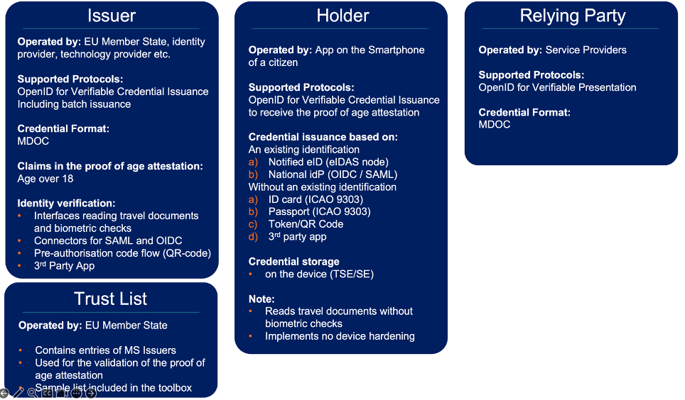

# ANNEX 3 - Features of the White Label App

This document provides an overview on the features of the Age Verification White Label Solution. The white label solution is a toolbox and offers Age Verification App Providers, Proof of Age Attestation Providers and Proof of age verifiers (Relying Parties) the opportunity to decide which services and software components they want to use and which functionalities they may want to supplement with commercial offers.

The white label solution will be implemented based on the open source EUDI Wallet Reference implementation libraries. 

<figure>

</figure>

## A.3.1	Definitions, Acronyms, and Abbreviations 

A list of the abbreviations and acronyms used in this document. 

  | **Acronym** | **Definition** |
  |--------------|----------------------------------------------------------|
  | Implementer    | An implementer is an individual who is responsible for                 translating software designs, specifications, or concepts into functional, operational systems. Presumably this is a contractor of the Age Verification App Provider, Proof of      Age Attestation Provider or Proof of age verifier.

## A.3.2 White label Application

The White label App shall include key functionality that is highlighted in the following section.

The white label app shall include an enrollment and issuing functionality to support \[OpenID4VCI\] Authorization Code flow as the main method utilizing eID based authentication using delegation to an eIDAS node or a trusted identity provider. The credential-offer flow in
the \[OpenID4VCI\] is not within the scope of the white label solution.

Additionally, the white label app shall include functionality to scan the ICAO9303 Machine Readable Zone (MRZ) utilizing existing open source library capable of scanning or capturing an image of the data page, enabling extraction of the MRZ, and following utilizing existing open source library to read using NFC and with Basic Access Control ICAO9303 passport and identity data. Following the app shall be possible to transmit the data to the age verification issuing server. An interface to obtain travel document results from an external module should replace the aforementioned process, subsequently forwarding data to the issuing server for digital signature confirmation as age verification.

Implementers\' additional steps may include:

1.  Service to check the authenticity of an ICAO9303 ID/Passport is not included. The implementor shall be responsible for validating a National eID's and ePassport's authenticity against a national IACA and/or Schengen masterlist. An interface to check an issuing    authority public certificate will be available in the white label app for this purpose.

2.  A liveness and biometrics matching service is not included. Member States may opt to include these features; however, the issuing service should connect to it.

Furthermore, the white label app shall include functionality to allow the use of a QR code and/or token following an out-of-band identification (e.g. over the counter or through an existing app that has already identified the user with a sufficient level of assurance). The QR code and/or token shall be based on the Pre-Authorized Code Flow of OpenID4VCI.

The white label application features also include the use of obfuscation and code protection of the primary library of the app in binary format.

Implementers\' additional steps may include:

1.  The app configuration and UI shall be further protected using code hardening and runtime application self-protection or similar security measures to protect the total application against malicious attacks.

2.  The app attestation checks are not included in scope (including anti-root measures, etc.), with implementation responsibility resting with the implementers.

The white label app shall include localization and branding capabilities by enhancing the UI per the official languages of at least three Member States.

The white label app does not include app back-end services, which are considered out of scope. All the data is stored in the device, not in cloud.

The terms and conditions and the privacy notice shall be included by the Implementers, and the white label app shall provide a placeholder to facilitate this.

The white label app includes key features for remote presentation using \[OpenID4VP\].

The white label app does not include proximity capabilities (ISO 18013-5).

## A.3.3 Age Verification Issuing Service

The age verification issuing service included in the white label solution shall support mDoc and follow \[OpenID4VCI\] authentication code flow. The issuing service shall support batch issuing for the age over nn attestation.

The claims of the proof of age attestation are statically calculated from the enrollment document. No zero-knowledge proof is used in the first version. Consequently, when an individual reaches the age of nn, they must obtain a new proof of age attestation.

The age verification issuing service shall include connectors for eIDAS node with SAML and OpenID Connect integration points for identity providers. Furthermore, an extra module shall be included in the issuing service that shall receive passport/id data from the white label app to produce the age over nn attestation. The issuing service will also include capabilities for Pre-Authorized Code Flow using QR code/token.

Automatic attestation re-issuing is not in scope for the white label app deployment. A refresh token could theoretically be used to re-issue the proof of age attestation. However, since the claims do not contain the date of birth, the user would need to repeat the enrollment process to
recalculate the claims. For this reason, refresh tokens are only practical when used in combination with zero-knowledge proofs. Additionally, revocation is not included in the first version of the issuing service.

Implementers\' additional steps shall include:

The PKI IACA and Document Signer (ISO18013-5 annex B provisions) are not
included in the scope, and the Implementer must implement them.

## A.3.4 Trusted list

Issuers' trusted lists (ETSI) shall be deployed and managed by the
Member States.

The white label solution includes a sample trusted list and a validation
service. The white label application and the relying party will validate
the trusted list using the validation service.

## A.3.5 Age Verification Service

In the toolbox, an age verification service that supports \[OpenID4VP\]
using mDoc age over nn attestation shall be available. The service shall
include an mDoc trust manager to verify the MSO validity and
authenticity. In order to check the authenticity based on ETSI Trusted
lists validation shall be provided by the implementers.

## A.3.6 Overview of implementers\' actions for deployment of age verification

Depending on the implementers' roles as an issuer, relying party or white label app provider, one or more of the following actions shall be performed:

1.  Integrate the issuing service to the national and/or other trusted eID services including eIDAS nodes.

2.  The Implementers shall Secure, Protect, Deploy and Maintain the services from the Toolbox for

    a.  Issuing Service

    b.  Verification Service

3.  Finalize app configuration (i.e. translations), compile, secure and publish the Apps from the toolbox.

Additional operational, security, performance and integration measures will be provided in the next version of this document.
