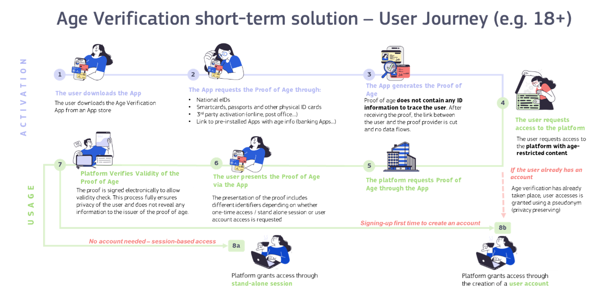
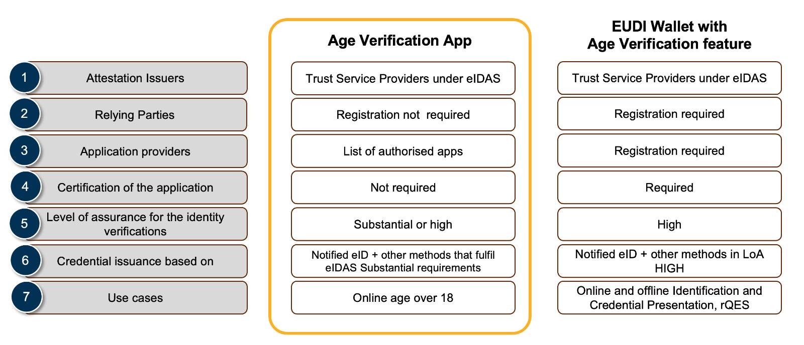
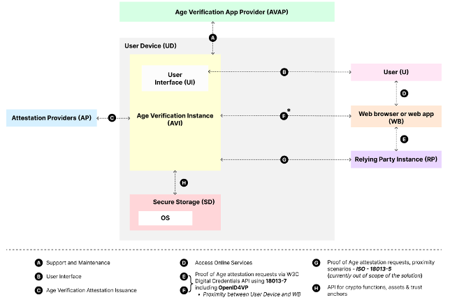
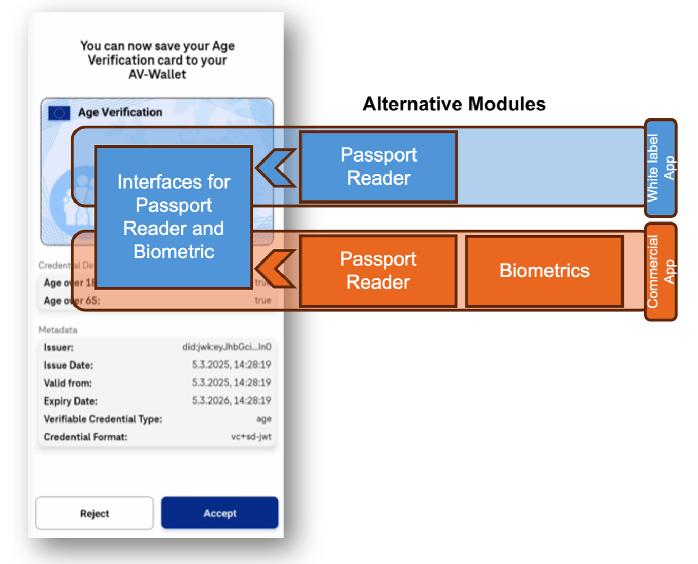
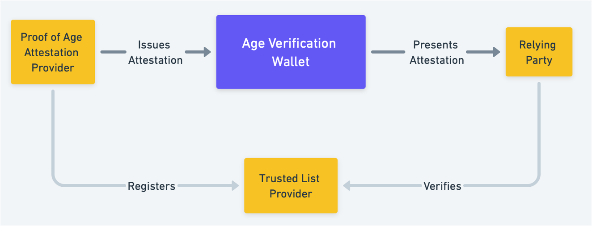
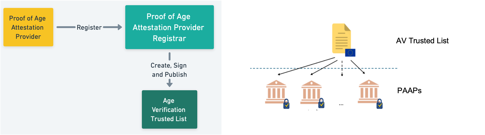
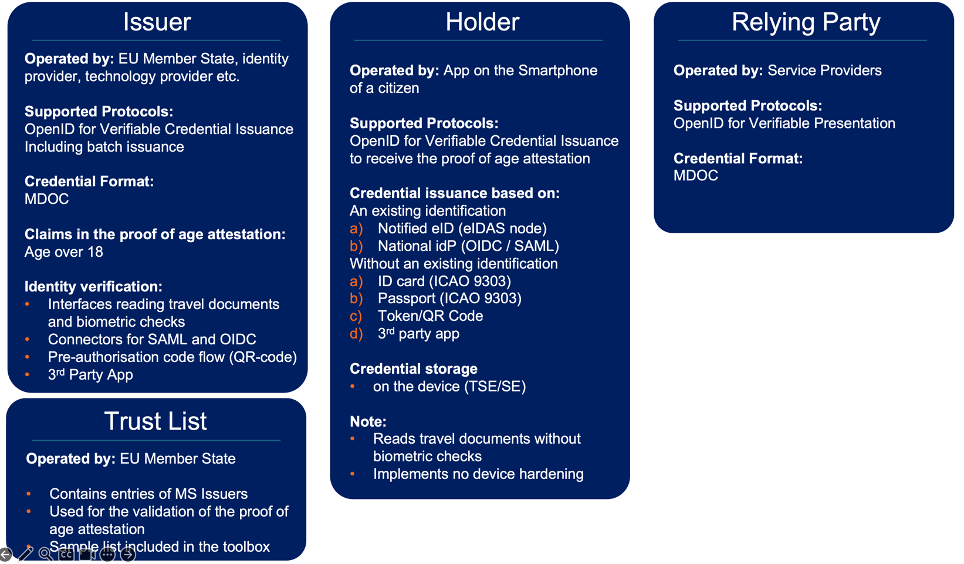

# Operational, Security, Product, and Architecture Specifications

## 1. Introduction

### 1.1 Purpose of this document

The purpose of this document is to provide a comprehensive specification that 
combines a Software Requirements Specification (SRS) and an Architecture 
Description (AD) for the age verification solution for online services to protect 
minors. The document defines both the functional and non-functional requirements, 
as well as the system architecture, with the objective of harmonising the 
development of age verification solutions within the EU. This approach aims to 
deliver a cross-border solution that minimises development effort and duplication 
among Member States, while fostering synergies.

The structure of this document is based on the relevant IEEE standards, 
specifically, \[IEEE 830-1998\] for Software Requirements Specifications and 
[ISO/IEC/IEEE 42010:2022\] for Architecture Descriptions, but has been adapted to 
meet the specific needs and context of this project.

This document aims to facilitate clear understanding of the intended system 
behaviour, constraints, and architectural decisions. Furthermore, it provides 
Member States and other interested parties with a foundation for implementing 
compliant systems.

Section 4 "Age Verification Solution high level requirements" of this document 
includes normative requirements for the Proof of Age attestation,  Age Verification
Apps, Attestation Providers, Relying Parties, and Trusted Lists.  

### 1.2 Scope of this development
This document defines the structural and functional aspects of the age 
verification solution for online services. It details the key components, 
interfaces, and interactions within the age verification ecosystem, providing a 
technical foundation to ensure interoperability, security, privacy and compliance 
with applicable regulatory and industry requirements.

The scope includes:

* The end-to-end process for issuing, presenting, and verifying Proof of Age 
attestations for access to online services, including age-restricted content, 
products, or services.

* The operational, security, product, and architectural requirements necessary 
for a harmonised and scalable solution that can be adopted and extended by Member 
States or other actors.

* The definition of system boundaries, including the roles of Attestation 
Providers, Relying Parties, and Users, as well as the interactions between these 
entities.

* The technical requirements for device compatibility, focusing on enabling Users 
to present Proof of Age attestations across commonly used devices such as mobile 
phones, tablets, laptops, and desktop computers.

* The specification of interoperability mechanisms to support integration with 
existing and future digital identity solutions, including the planned 
incorporation into EU Digital Identity Wallets.

This specification does not cover the internal implementation details of 
third-party Relying Parties, the development of alternative age verification 
methods beyond those explicitly described, or the detailed integration of 
operational systems required for an enrolment, as this is subject to 
country-specific requirements. It serves as a reference for the harmonised 
implementation of age verification solutions across the European Union.

This specification builds upon the Architecture and Reference Framework 
([ARF](https://eu-digital-identity-wallet.github.io/eudi-doc-architecture-and-reference-framework/)) 
for the European Digital Identity (EUDI) Wallets, adopting the same foundational 
technical standards and design principles to ensure interoperability, security, 
and privacy within the EU digital identity ecosystem. However, it defines only a 
subset of the requirements and functionalities compared to a full EUDI Wallet 
implementation, focusing specifically on the needs of age verification solutions. 
The objective is to provide a compatible architecture that facilitates seamless 
integration with EUDI Wallets as the ecosystem evolves.

### 1.3 Definitions, Acronyms and Abbreviations
For the purposes of the present document, the terms and definitions given in EU 
Digital Identity Architecture and Reference Framework and the following apply. A 
term defined in the present document takes precedence over the definition of the 
same term, if any, in EU Digital Identity Architecture and Reference Framework.

#### 1.3.1 Definitions
For the purposes of the present document, the following terms and definitions 
apply:

* **Attestation Provider**: Natural or legal person that provides the Proof of 
Age attestation to the User of an Age Verification App Instance.  
* **Authentic Source**: A repository or system, held under the responsibility of 
a public sector body or private entity, that contains and provides attributes 
about a natural or legal person or object and that is considered to be a primary 
source of that information or recognised as authentic in accordance with Union 
law or national law, including administrative practice.  
* **Age Verification App**: A unique configuration of an Age Verification 
Solution by an Age Verification App Provider to a User seeking to access 
age-restricted content or services. A User requests, receives, and manages their 
Proof of Age attestation with this app and presents the Proof of Age attestation 
using this app when required to Relying Parties.  
* **Age Verification App Instance**: The Age Verification App installed and 
configured on a User’s device.  
* **Age Verification App Provider**: A natural or legal person who provides Age 
Verification Solutions.   
* **Age Verification Solution**: A combination of software, hardware, services, 
settings, and configurations  
* **Implementer**: Αn individual who is responsible for translating software 
designs, specifications, or concepts into functional, operational systems. 
Presumably this is a contractor of the Age Verification App Provider, Proof of 
Age Attestation Provider or Relying Party.  
* **Level of Assurance.** Assurance levels as defined in Commission Implementing 
Regulation (EU) 2015/1502  
* **Proof of Age attestation**: An attestation which includes information about 
the age of the User using the data model defined in this document.  
* **Relying Party**: Natural or legal person that relies on the Age Verification 
App to verify the User condition of being over certain age.  
* **Third Party Data Sources**: A trusted private data source is a 
non-governmental, commercially operated entity that maintains accurate and 
verifiable User information, which can be leveraged for age verification purposes 
(e.g. bank, mobile network operators, utility provider).  
* **Trust Provider**: Operator of an entity or mechanism responsible for 
maintaining a trusted list (whitelist) of all authorised Attestation Providers. 
This ensures that Relying Parties and Users can validate the legitimacy and 
authorisation of entities participating in the ecosystem.  
* **User**: A User who is in control of an Age Verification App Instance.

#### 1.3.2 Acronyms and Abbreviations
For the purposes of the present document, the following abbreviations and 
acronyms apply:

| Term                | Definition |
|:--------------------| :---- |
| AP                  | Attestation Provider |
| ARF                 | Architecture and Reference Framework |
| AV app              | Age Verification App |
| AVI                 | Age Verification App Instance |
| AVAP                | Age Verification App Provider |
| CA                  | Certificate Authority |
| DG CNECT            | Directorate General Network, Content and Technology |
| eIDAS               | Electronic Identification, Authentication and Trust Services |
| EU                  | European Union |
| EUDI                | European Digital Identity |
| EUDIW / EUDI Wallet | European Digital Identity Wallet |
| LoA                 | Level of Assurance |
| U                   | User |
| RP                  | Relying Party  |
| T-Scy               | Scytáles & T-Systems Age consortium |
| WB                  | Web Browser (or web app) |
| ZKP                 | Zero Knowledge Proof |

### 1.4 Conventions
The terms "SHALL," "SHALL NOT," "MAY", "SHOULD," and "SHOULD NOT" in this 
document are to be interpreted as defined in RFC 2119 (Key words for use in 
RFCs to Indicate Requirement Levels). Their meanings are as follows:

* **SHALL:** Indicates a mandatory requirement; compliance is required.

* **SHALL NOT:** Indicates a mandatory prohibition; compliance is required.

* **SHOULD:** Indicates a recommended requirement; there may exist valid 
reasons to ignore it in particular circumstances, but the full implications 
must be understood and carefully weighed before choosing a different course.

* **SHOULD NOT:** Indicates a recommended prohibition; there may exist valid 
reasons in particular circumstances when the particular behavior is 
acceptable or even useful, but the full implications should be understood and 
the case carefully weighed before implementing any behavior described with 
this label.

* **MAY:** Indicates an optional requirement; implementation is permitted but 
not required.

These keywords are used throughout this document to clarify the level of 
obligation associated with each requirement.

### 1.5 References
References are classified as either specific (identified by date of 
publication and/or version number) or non-specific. For specific references, 
only the cited version is applicable. For non-specific references, the most 
recent version of the referenced document (including any amendments) shall apply.

#### 1.5.1 Normative References
The following referenced documents are essential for the application of this document.

| Item Reference | Standard name/details |
| :---- | :---- |
| \[ISO/IEC 18013-5\] | [ISO/IEC 18013-5:2021: Personal identification — ISO-compliant driving licence. Part 5: Mobile driving licence (mDL) application. Edition 1, 2021\.](https://www.iso.org/standard/69084.html) |
| \[ISO/IEC 18013-7\] | [ISO/IEC TS 18013-7:2025: Personal identification — ISO-compliant driving licence. Part 7: Mobile driving licence (mDL) add-on functions. Edition 2, 2025\.](https://www.iso.org/standard/91154.html) |
| \[OpenID4VP\] | [OpenID for Verifiable Presentations](https://openid.net/specs/openid-4-verifiable-presentations-1_0-24.html) |
| [W3C Digital Credentials API] | Caceres, M., Cappalli, T., Goto, S. *et al,* "[Digital Credentials API](https://w3c-fedid.github.io/digital-credentials/)", Draft Community Group Report |

#### 1.5.2 Informative References
The documents listed below are not required for the implementation of this 
document; however, they provide additional guidance and context on specific 
subject areas.

| Item Reference | Standard name/details |
| :---- | :---- |
| \[ARF\] | [EU Digital Identity Architecture and Reference Framework](https://eu-digital-identity-wallet.github.io/eudi-doc-architecture-and-reference-framework/1.10.0/)|
|\[OpenID4VCI\]  | [OpenID for Verifiable Credential Issuance](https://openid.net/specs/openid-4-verifiable-credential-issuance-1_0-ID2.html) |
| \[HAIP\] | [OpenID4VC High Assurance Interoperability Profile with SD-JWT VC](https://openid.net/specs/openid4vc-high-assurance-interoperability-profile-1_0.html) |
| \[OIDC\] | [Final: OpenID Connect Core 1.0 incorporating errata set 2](https://openid.net/specs/openid-connect-core-1_0.html) |
| \[ISO/IEC 23220-2\] | [ISO/IEC TS 23220-2:2024: Cards and security devices for personal identification — Building blocks for identity management via mobile devices. Part 2: Data objects and encoding rules for generic eID systems. Edition 1, 2024\.](https://www.iso.org/standard/86782.html) |
| \[ISO/IEC CD TS 23220-3\] | ISO/IEC CD TS 23220-3: Cards and security devices for personal identification — Building blocks for identity management via mobile devices. Part 3: Protocols and services for issuing phase |
| \[ISO/IEC CD TS 23220-4\] | [OISO/IEC CD TS 23220-4: Cards and security devices for personal identification — Building blocks for identity management via mobile devices. Part 4: Protocols and services for operational phase.](https://www.iso.org/standard/86785.html) |
| \[IETF RFC 2119\] | [Key words for use in RFCs to Indicate Requirement Levels](https://datatracker.ietf.org/doc/html/rfc2119) |
| \[IEEE 830-1998\] | [Recommended Practice for Software Requirements Specifications](https://standards.ieee.org/ieee/830/1222/) |
| \[ISO/IEC/IEEE 42010:2022\] | [Software, systems and enterprise — Architecture description](https://www.iso.org/standard/74393.html) |

## 2 Overall Description of the Age Verification Solution
The primary objective is to develop an EU-wide solution to age verification 
that reinforces the [Digital Services Act (DSA)](https://eur-lex.europa.eu/eli/reg/2022/2065) 
objective to ensure safe, secure, and trusted digital space (notably Article 
28, which focuses on protecting minors) and the [Louvain-la-Neuve Declaration](https://bosa.belgium.be/sites/default/files/content/documents/LLN%20Declaration%20-%20Informal%20Telecom%20Council%20-%20v.12.04.2024.pdf), 
which promotes a safer and more trustworthy online environment. The proposed 
solution is intended to bridge the gap until the EU Digital Identity (EUDI) 
Wallets become available by the end of 2026, enabling the incorporation of 
the age verification functionality in them.

As stated in the Louvain-la-Neuve Declaration, "the presence of online 
harmful content and systemic risks continues to be a major concern as the use 
of social media, in particular by children, increasingly plays a formative 
role in their daily lives". Creating a safer, more secure, and trusted 
digital environment therefore has to be at the heart of Europe's digital 
strategy, with a firm commitment to support, empower and respect children 
online and protect them from harmful content and systemic risks. The 
Louvain-la-Neuve Declaration also calls on the European Commission to bring 
together the tools available under the Digital Services Act (DSA) and the 
European Digital Identity Wallet, to provide comprehensive safeguards for the 
users of digital services in the Union, in particular the most vulnerable 
groups, for example children.

As stated in the study "[Mapping age assurance typologies and requirements](https://data.europa.eu/doi/10.2759/455338)", 
age verification solutions provide a high degree of certainty in determining 
the age of a user. Through this design document we are defining a Europe-wide 
effective and convenient method to age-gate access to specific online 
services.

Age verification plays a crucial role across various scenarios, including:

* Access to online services: Verifying age for online services offering 
age-restricted content or services, such as adult media, gambling, or other 
content deemed unsafe for minors.

* Purchases of age-restricted products: Ensuring legal compliance when 
purchasing products like alcohol or tobacco, both online and in physical 
stores.

* Age-related benefits: Validating eligibility for discounts or services 
offered to specific age groups, such as young or elderly individuals.

Given the regulatory priorities and societal needs, this document focuses on 
age verification for accessing online services with restricted content or 
services. However the proposed solution defined in this document is not 
exclusive to this use case but can be used broader in the scenarios mentioned 
above.

The age verification solution will serve as a foundational component of the 
European Union’s efforts to create a safer digital environment. This document 
will contribute to the development of a future Age Verification Rulebook, 
which will be included in the Electronic Attestation Catalogue under the 
governance of the European Digital Identity Regulation.

By establishing a secure, privacy-preserving, and interoperable framework for 
age verification, this initiative will empower users, online services, and 
regulators to uphold digital safety and inclusivity while ensuring compliance 
with Union law.

It must however be understood that bypassing regional requirements is trivial 
to most users with a simple online search, and the realities of the simplicity
and the dangers of driving users to that SHALL also be taken seriously and the
solution SHALL thus only be proportional to the real needs and real risks.

The solution SHALL ensure that it will not be possible, regardless of future 
malicious intent or being compromised, for any party to collect information of 
who is using what services from the age verification flows, i.e. the parties 
requesting age verification SHALL NOT learn the identity of the users from the 
flow, and the parties providing verification SHALL NOT learn the identity of 
the requesting parties, and SHOULD NOT learn the identity of the users if it 
is feasible to avoid that.

### 2.1 Perspective of the Age Verification Solution
Once Proof of Age attestations are issued, they can be presented and verified 
by online services in a simple, secure, and privacy-preserving manner. This 
capability is supported by the following elements:

* **Open Technical Specifications:** A comprehensive suite of open technical 
specifications has been developed to support the implementation of the 
end-to-end solution. These specifications cover the entire lifecycle, from 
the issuance of age attestations to their verification by online services. 
Their development involved close collaboration with all relevant 
stakeholders-including Member States, industry representatives, and technical 
experts-to ensure alignment with regulatory requirements, technological 
advancements, and user needs. This inclusive approach promotes 
interoperability and facilitates broad adoption of the solution.

* **Integration with the European Digital Identity Regulation:** The solution 
leverages the existing eIDAS infrastructure, including eIDAS nodes and the 
trust framework for trusted services, to ensure a high level of security and 
reliability. By aligning with the technical architecture of the EU Digital Identity Wallet
[ARF](https://eu-digital-identity-wallet.github.io/eudi-doc-architecture-and-reference-framework/), 
the solution delivers private, secure, reusable, and interoperable proofs of 
age. This approach ensures compliance with EU standards, enabling trusted 
interoperability and seamless cross-border functionality.

* **Reference Implementation:** A reference implementation, including a 
white-label Age Verification App, is provided to facilitate the widespread 
deployment and adoption of age verification solutions.

By ensuring compliance with the standards outlined in the EU Digital Identity 
Architecture and Reference Framework (ARF), this solution establishes a 
foundation for long-term sustainability and interoperability. The Age 
Verification Profile defined in Annex A is designed to be forward-compatible 
with future EUDI Wallets. 

### 2.2 Functions of the Age Verification Solution
The Age Verification Solution provides a set of key functional capabilities 
that support the issuance, presentation, and verification of Proof of Age 
attestations across the European Union. The following subsections describe 
the key capabilities that support this functionality.

#### 2.2.1 Flexible Enrolment Methods
A primary function of the solution is the issuance of Proof of Age 
attestations that can be used across the European Union. These attestations 
enable individuals to demonstrate that they meet a specific age threshold, 
currently focused on "over 18", to access age-restricted online services and 
content. The solution is designed to be extensible, allowing support for 
other age groups (e.g., "over 14" or "over 65") provided that appropriate 
enrolment methods are available.

Users have the flexibility to choose from multiple enrolment methods to 
obtain their Proof of Age attestation. Currently supported methods include:

* Scanning or reading an electronic identity card (eID) or a passport.  
* Using existing identification systems provided by 3rd party providers or 
apps.  
* Other secure identity proofing processes as defined by Member States.

These enrolment methods ensure that the Proof of Age attestation is based on 
reliable and verifiable identity information. Enrolment SHALL be possible to 
also be conducted on-site to accommodate users who may not have access to 
electronic identification means.

Proof of Age attestation SHALL NOT depend on a mobile device, specific
operating systems, authorization or verification of the devices, or limiting
the other software individuals are allowed to run on their devices.

Member States and solution providers retain the autonomy to determine which 
enrolment options they offer within the age verification solution. This 
flexibility acknowledges the diversity of national identification systems, 
regulatory environments, and user needs across the European Union.

#### 2.2.2 Presentation of a Proof of Age attestation
The solution enables users to present their Proof of Age attestation to 
Relying Parties, primarily for online use cases. The system is optimised for 
secure and privacy-preserving online presentation, allowing users to prove 
their eligibility without disclosing any additional personal information. The 
solution can in principle also be adapted to support offline or 
proximity-based presentations.

#### 2.2.3 Revocation and Re-Issuance
In its current form, the solution does not support revocation or re-issuance. 
Adding support for these features would introduce additional complexity, 
which could hinder the rapid adoption of the solution.

#### 2.2.4 Verifiable across Member States
A Trusted List is maintained as part of the solution, allowing Relying 
Parties and Users to validate which entities are legally authorized to issue 
Proof of Age attestations. This enhances trust and interoperability across 
Member States by ensuring that only recognised authorities participate in the 
issuance process.

#### 2.2.5 Extensibility
While the current implementation focuses on the "over 18" age threshold, the 
technical architecture supports extension to other age groups as required by 
regulatory or business needs. The same applies also to additional enrolment 
options. The only prerequisite is the availability of a suitable enrolment 
process for the target age group, which can be also adapted or conducted 
on-site if necessary.

### 2.3 User Journey
To enable online age verification, the User SHALL NOT be required to install
any applications on their mobile device. A web based AV app allows the User to 
securely and reliably present proof of age without disclosing any additional 
personal information. For instance, the User can demonstrate that they meet a 
minimum age requirement-such as being at least 18 years old-without revealing 
their exact age, name, or other sensitive details. This approach ensures both
privacy and strict adherence to applicable data protection standards, as well
as creating additional limitations to the freedoms of Users, any additional
dependency on otherwise unnecessary or unwanted mobile devices to Users, or
a risk from depending on the significant mobile device vendors abusing their
dominant roles in the industry and e.g. forcing users to accept their Terms of
Service or Privacy Policy to verify the integrity of their devices or similar.

The following illustration and accompanying description outline a 
scenario-based sequence of the steps a User undertakes to achieve this 
objective using the proposed age verification solution. This User journey 
spans multiple channels and points in time, highlighting the seamless 
interaction between the User, the AV app, and the online service.

*Figure 1: Journey of a Proof of Age attestation user*

The flow SHALL be possible to complete without a second device, regardless of 
which type of device the User is using - mobile, laptop, desktop, and so on.

The web app SHALL be designed to function offline using e.g. PWA technologies,
without needing to connect to the servers once the initial Proof of Age has
been generated. This is to ensure the service provides the necessary
level of privacy and availability for Users under any circumstances.

The age verification process consists of two main phases: Activation and 
Usage. The steps are illustrated in Figure 1 and detailed below:

**Activation**

*Initial setup (step 1\)*

* The User visits the AV web app, and the software is stored locally on the
User's machine for future offline use.

* If required by the AV web app, notably if it supports multiple user profiles, 
the User creates a local profile in the AV web app to facilitate subsequent 
verification processes.

*Requesting a Proof of Age attestation (step 2\)*

* The User requests a Proof of Age attestation from a designated AP, which 
will issue it after verifying the User's identity at a level of assurance 
equivalent to "substantial" or "high" pursuant to Commission Implementing 
Regulation (EU) 2015/1502 through the following methods:

  * Notified or national eID schemes.

  * Leveraging existing databases: Identity verification is conducted through 
  recognised and well-established processes already in use for personal 
  identification under national or Union law, such as national identity 
  providers covering the level of assurance.

  * Know Your Customer (KYC) procedures employed by banks or the identity 
  verification methods used for issuing SIM cards by Mobile Network Operators.

  * Document-Based Verification: Confirming the User’s age using official 
  identification documents such as electronic ID cards, passports, or other 
  government-issued credentials. The link between the document and the User 
  should be verified.

*Issuance of Proof of Age attestations (step 3\)*

* Once the User's age has been verified, the AP may either issue the Proof of 
Age attestation directly to the User's AVI or generate a pre-authorized code 
and provide it to the User as part of a credential offer. At a later stage, 
the User can present this credential offer through their AVI to obtain the
Proof of Age attestation.

* This attestation is securely stored within the AVI and can be used to prove 
the User's age to online services.

**Usage**

*User requests access to age-restricted services (step 4\)*

* After activation, the User can use the AVI to present their Proof of Age 
attestation to access age-restricted content or services.

* The User initiates access by requesting a service or content on the RP.

*Service requests Proof of Age attestation (step 5\)*

* The RP replies by requesting a Proof of Age, typically by providing all of 
the following mechanisms:

  * A file containing the minimum age required, and a nonce for the request.

  * A text based token containing the same information, to use via copy & 
paste or similar functions, using e.g. Base64 encoded JSON, or Base45 encoded
CBOR as in the EU COVID passports.

  * A QR code that can be scanned via the AVI to read the information. 

*Confirmation and presentation (step 6\)*

* The User opens the AVI and uploads the file, pastes the token, or scans the 
QR code to initiate the request flow.
  
* The AVI receives the Proof of Age request and presents it to the User. The 
User reviews the request details, verifies the information, and confirms the 
transaction to proceed. The process SHALL be completely offline and not 
transmit any information to any server.

* The AVI provides the Proof of Age attestation with the secure nonce to the 
User.

* The User provides the Proof of Age attestation to the RP.

*Verification and access (step 7\)*

* The RP verifies the Proof of Age attestation by:

  * Checking the attestation's validity and digital signature.

  * Ensuring the attestation states the user has met the minimum age
requirement.

* If the verification is successful, the RP grants the User access to the 
requested service or product.

*Verification options for subsequent interactions (steps 8a/8b)*

* On-Demand Verification (8a): RPs may request the Proof of Age attestation 
each time the User attempts to access restricted content or services, 
without storing it in any session or account, ensuring privacy and 
minimising data retention.

* Stored Verification(8b): RPs may optionally store information derived from 
the Proof of Age attestation in the User's account, allowing the User to 
bypass repeated verification for future visits or purchases, streamlining 
the User experience.

This flow ensures the RP can never be identified by the AVI, and no unnecessary
information about the User can be identified by the RP beyond simply the pass
or fail to the minimum age requirement.

### 2.4 Design principles

To enable rapid and reliable deployment of the age verification solution, 
the solution adheres to the following approach:

* **Reliance on existing standards:** Where possible, it prioritizes the use 
of available standards and specifications to expedite development and 
integration. The [ARF](https://eu-digital-identity-wallet.github.io/eudi-doc-architecture-and-reference-framework/)
serves as the primary pool of standards.

* **Collaboration with established APs:** The solution engages institutions 
capable of mass-issuing Proof of Age attestations, such as banks, mobile 
network operators, and governmental population registers.

* **Involvement of key stakeholders:** The solution partners with actors 
skilled in app development and eGovernment solutions, including mobile 
operating system providers, wallet solution providers, and operators of 
citizen-facing applications.

Furthermore, to ensure a robust and reliable solution, the framework is 
driven by the following design principles:

* **Data protection:**

  * **Data minimisation:** Only the necessary user attributes or attribute 
  statements for a specific transaction are released, in accordance with the 
  principle of data minimisation. This is achieved by implementing 
  technologies that inherently restrict data exposure and safeguard user 
  privacy. Domain-specific identifiers, or pseudonyms, are used to enable 
  users to avoid relying on the same unique identifier when interacting with 
  online services.

  * **Unlinkability:** The solution SHALL prevent user profiling and tracking
  by avoiding linkable transactions. Initially, the solution will rely on 
  batch issuance to protect users from colluding RPs. Zero-Knowledge Proof 
  (ZKP) mechanisms will be considered to offer protection. More details are 
  provided in Section 7. 

  * **Storage limitation:** Data is retained by all involved parties only 
  for as long as necessary for the purposes of age verification.

  * **Transparency:** Users receive clear information about how their 
  personal data is used.

* **Data security:** User data and credentials are securely stored to ensure 
confidentiality, authenticity, integrity, and availability. This protection 
safeguards data against unauthorised access, destruction, misuse, 
alteration, disclosure or loss.

* **Cloning protection:** Cloning protection prevents the unauthorised 
duplication of credentials and user data. This measure ensures that illicit 
reproduction of credentials does not grant unauthorised parties privileges 
they would not otherwise possess.

* **Eavesdropping protection:** The protocols implemented within the age 
verification solution leverage secure communications channels preventing 
unauthorised interception and exposure of personal data. There SHALL NOT be
direct communication between parties that must not be able to identify each
other, e.g. the RP SHALL NOT communicate with the AVI, and the AVI SHALL NOT
communicate with the RP.

* **Interoperability:** The solution ensures seamless integration across 
diverse device operating systems, wallet applications, and online services.

* **User binding:** User attributes and credentials are securely bound to 
the legitimate user to whom they are issued. This ensures the fundamental 
functionality of any government-issued document: accurately associating 
attributes with the individual to whom they apply.

* **User centricity:** The system is user-centric, allowing users to 
maintain control over their attributes and provide informed consent for 
their use, whether the attributes are managed locally or remotely by an 
identity or attribute provider.

* **User experience:** The solution provides a simple and intuitive process 
for users to verify their age and share attestations when required.

* **Compliance:** The solution aligns with data protection regulations, 
including GDPR, particularly the principles of data protection by design and 
by default, and adheres to the European Digital Identity Regulation. The 
solution SHALL also take strong measures to ensure DMA is followed and no
additional dependency is built especially to designated gatekeepers, especially 
Google Play, Apple App Store, Chrome, Android, iOS, or Windows. There SHALL NOT 
be any use of services or capabilities that depend on entities that are not 
based in the EU.

* **Equity:** The solution is designed to be accessible and inclusive, 
ensuring that users with varying levels of technological access or 
proficiency can participate without barriers. Remedies, such as alternative 
attestation issuance procedures or human intervention, are available for 
cases where individuals cannot use the mainstream procedure, for example due 
to a lack of necessary identity documents or electronic identification means.
There SHALL NOT be any dependency on expensive mobile devices, as the states
do not provide such devices to the Users without charge. Users SHALL be able
to use the devices they wish, any common browser, on any operating system,
without restricting their access to services available to other citizens.

Any limits or requirements here SHALL only be implemented to a suitably 
proportional degree considering the ease of bypassing age verification and 
the risks doing so poses on the User, as well as limitations of not depending 
on specific hardware, operating systems, or software solutions that would 
limit the freedom of choice, privacy, and security of the Users.

### 2.5 Assumptions and Dependencies
This specification operates under the following foundational assumptions:

#### 2.5.1 Legal Compliance in Member States
It is assumed that EU Member States have established appropriate legal 
frameworks to authorise the collection and processing of data required for 
issuing Proof of Age attestations. This includes compliance with GDPR, the 
Digital Services Act (DSA), and national laws governing identity 
verification and age-restricted services. The enrolment methods (e.g., eID, 
passport scans) rely on these legal bases to ensure lawful data handling.

#### 2.5.2 Deployment and national adaptations
Member States or third-party entities are responsible for deploying the age 
verification solution in their jurisdictions. The solution is provided as a 
white-label, open-source implementation, enabling customisation to meet 
national legal, technical, and security requirements. No operational 
responsibility is retained by the project consortium.

Member States are responsible for modifying the solution to align with 
national legal requirements (e.g., age thresholds, data retention policies) 
and security standards (e.g., certification of Attestation Provider, 
encryption protocols). The specification provides modular components to 
facilitate these adaptations without compromising interoperability.

#### 2.5.3 Open-Source Implementation
The project exclusively provides an open-source reference implementation via 
public repositories (e.g., published on GitHub). Member States and third 
parties are responsible for hosting, maintaining, and adapting the solution 
to their infrastructure. The solutions by the Member States must also be 
provided fully as open-source in public repositories, as their security is 
crucial to the privacy of the citizens, and the development is paid from taxes.

#### 2.5.4 Alignment with EU Digital Identity Architecture
The solution assumes ongoing development of the EU Digital Identity Wallet's 
Architecture and Reference Framework ([ARF](https://eu-digital-identity-wallet.github.io/eudi-doc-architecture-and-reference-framework/)). 
By adhering to the [ARF](https://eu-digital-identity-wallet.github.io/eudi-doc-architecture-and-reference-framework/)'s 
evolving specifications, the age verification solution ensures 
interoperability with future EU Digital Identity Wallets and leverages 
synergies in trust frameworks, cryptographic standards, and governance models.

#### 2.5.5 Identifying and responding constant risks to privacy and security from within the EU
As it is blatantly clear that the members of the EU are regularly attempting 
to destroy the right to privacy and security of its citizens, by e.g. 
attempting to destroy the security of encryption and mandating "master keys" 
or other backdoors to services, additional security measures SHALL be 
considered here to ensure that e.g. dependency on simple encryption is not the 
only means to preserve the users' privacy and security. There SHALL NOT
be any possibility for the Users' use of RPs to be identified even in case of
a failure in encryption protocols' ability to provide security.

References:

- https://en.wikipedia.org/wiki/Regulation_to_Prevent_and_Combat_Child_Sexual_Abuse
- https://chatcontrol.dk/en/
- https://eutoday.net/eu-reconsiders-chat-control/

### 2.6 Key differences between the Age Verification application and the Age Verification functionality in the EUDI Wallet
The Age Verification solution is intended to bridge the gap until the EUDI 
Wallets become available by the end of 2026, enabling the incorporation of 
the age verification functionality in them. This section describes the key 
differences between the Age Verification application and the age 
verification functionality in the EUDI Wallet.

The trust framework of EUDI Wallet requires that the Wallet Solution is 
certified, and the Wallet Solution provider is registered. Also, the Relying 
Parties MAY be registered, but a Wallet Unit SHALL NOT be able to authenticate 
the Relying Party. In the Age Verification application there is no 
certification or registration need for the Age Verification App providers or 
the Relying Parties.

Onboarding of users to the European Digital Identity Wallet will be 
facilitated by relying on identity proofing process comparable to LoA high.

*Figure 2: Differences in trust frameworks depending on the way of making the age verification functionality available.*

The AV app is a stand-alone application that provides only the minimum 
functions. In case of authentication to the national eIDAS node, only the 
age verification attestation is stored. In this application no other ID data 
is stored than the ones described in section 4.1. 

*Figure 3: Authenticating to a national eIDAS node to receive the age verification attestation. Additional issuing options are available and analytically presented in the next sections.*

## 3. Architecture
The age verification solution defined in this document is guided by several
key objectives. First and foremost, the solution is intended to support age 
verification for access to online services, which is identified as a 
regulatory priority. By focusing on this specific use case, the deployment 
of the age verification solution can be accelerated, ensuring that it meets 
urgent regulatory needs while maintaining the potential for future expansion.

A further goal is to enable rapid and wide-scale deployment. Design 
decisions are made to support swift development, integration, and rollout of 
the solution, making it broadly accessible across the European Union. To 
ensure inclusion, the solution is designed for compatibility with all common 
devices used by Europeans to access online services, including mobile 
phones, tablets, laptops, and desktop computers. The primary delivery 
channel will be a white-label web application.

The solution relies on a web based proof of age model, leveraging browsers to 
store age attestations. This approach supports the goal of rapid deployment 
and broad accessibility. Alternative mechanisms for storing and presenting 
proof of age may be considered for future versions of the solution.

It is also recognised that devices may be shared among multiple users, for 
example, when a child has access to a parent’s mobile phone. Such scenarios 
are left for the parents of the children to solve as they see fit, e.g. by
limiting the access of their child to the device by using a password on it.

Certain elements are currently considered out of scope. Specifically, the 
use of the solution for purposes other than access to online services-such 
as for purchasing age-restricted products, obtaining age-related discounts, 
or other applications-is not a current priority. However, Age Verification 
App Providers may include such support, and design choices made in this 
document consider this possibility.

Additionally, the storage of Proof of Age attestations by remote services is 
excluded from the initial scope, as this would add complexity and 
potentially hinder rapid deployment. The possibility of utilising remote 
services for attestation storage may be revisited in future iterations, but, 
for now, technical standards that necessitate such reliance should be 
avoided.

In summary, the defined technical architecture design aims to balance 
regulatory compliance and practical deployment considerations, while 
remaining adaptable for future enhancements and broader use cases.

### 3.1 Interactions
* The User initiates an age verification process by enrolling with an 
Attestation Provider (AP), which collects the necessary evidence from 
authentic sources or trusted 3rd party private data sources.

* The AP generates a Proof of Age attestation and issues it to the Age 
Verification App Instance (AVI) of the User.

* The AVI allows the User to present the attestation to a Relying Party 
(RP) when attempting to access age-restricted services.

* The RP checks the validity of the attestation, referencing the trusted 
list to confirm the AP's authorisation.

The Cross Device flow means that the User presents their Proof of Age 
attestation to a Relying Party interacting with the User on a different 
device that the device the Age Verification App resides on. In this case the 
devices should be in proximity to each other to provide protection against 
certain attacks.

*Figure 5: Age verification solution components, interfaces and protocols - Cross Device*

### 3.2 Interfaces
The following interfaces are implemented by the Age Verification Solution:

#### 3.2.1 Authentic Source and Attestation Provider interface
Communication between an Authentic Source (e.g., government register or 
trusted private entity) and an Attestation Provider occurs via a proprietary 
interface, enabling customization to meet organizational or national needs. 
Integration supports modern RESTful HTTPS APIs as well as adapters for 
legacy systems. Each Attestation Provider typically implements a distinct 
business process for every data source, adding complexity to integration.

#### 3.2.2 Attestation Provider and Age Verification App Instance interface
This interface is used by the AVI to communicate with the AP to receive a 
Proof of Age attestation. This interface may be implemented using the protocols
specified in Annex A, ensuring standardised, interoperable credential exchange 
across Attestation Providers and Age Verification App Instances, An Age 
Verification App Instance can interface with any APs supporting the protocols 
specified in Annex A, enabling Users to obtain Proof of Age attestations from 
diverse providers (e.g., national eID schemes, banks, or mobile operators).
This implementation aligns with the EU Digital Identity Wallet's Architecture 
and Reference Framework ([ARF](https://eu-digital-identity-wallet.github.io/eudi-doc-architecture-and-reference-framework/)), ensuring cross-border interoperability. 

#### 3.2.3 Age Verification App Instance and Relying Party interface
This interface empowers RPs to privately and securely request and receive a 
Proof of Age attestation from an AVI. This interface is implemented using
the protocols specified in Annex A, ensuring standardised and interoperable 
presentation of verifiable credentials.

#### 3.2.4 Attestation Provider and Trust Provider interface
To distinguish an authorised AP from an unauthorised one, all APs MUST be 
registered with the EU and included in a centrally maintained trusted list. 

The registration interface follows a proprietary design.

#### 3.2.5 Relying Party and Trust Provider interface
An RP can use an HTTP GET Method to retrieve the trusted list.

### 3.3 Supported Enrolment Configurations
To achieve Level of Assurance "Substantial", the enrolment process must 
provide a reasonable degree of confidence in the claimed identity, balancing 
security with usability. The identity proofing must rely on notified eID 
means or on evidence based on official documents (such as a passport, 
national ID card, or equivalent), but it does not necessarily require 
in-person presence. Remote identification procedures may be used, provided 
that they ensure the reliability of the process and protect against 
impersonation and manipulation.

At this level, identity verification may include automated or manual checks 
of the identification document, cross-checks with authoritative sources (e.g.,
population registries), and verification that the person presenting the 
identity is its rightful holder.

The enrolment process must still ensure that identity data is collected and 
verified securely, and that it is resistant to common attacks (e.g., 
document forgery, replay attacks, and social engineering). Auditability, 
traceability, and appropriate risk management measures are also expected.

In the following two sub-sections, attestation enrolments approaches are 
introduced grouped in:

* Methods with existing Identification, where only Authentication is needed 
by the citizen.  
* Methods without existing Identification, where the citizen needs to 
provide proof of identification and binding to it.

At a high level, the issuing options are illustrated in the figure below. At 
least one of the options must be implemented.

*Figure 6: Enrolment options with and without existing identification.*

The above architecture diagram is a functional diagram. For examples of
physical mappings, see next clause.

#### 3.3.1 Enrolment Methods with existing Identification
To achieve Level of Assurance "Substantial", enrolment processes can 
effectively leverage existing identification mechanisms that have already 
been verified to meet substantial (or higher) assurance levels. This 
includes the use of notified eID schemes under eIDAS, accessed through eIDAS 
nodes, or integration with national Identity Providers (IdPs) that offer 
authentication at a substantial level.

When a user authenticates via one of these methods, the identity proofing 
has already been conducted by a recognised authority in accordance with 
applicable standards, allowing the Attestation Provider to reuse this 
assurance level for enrolment. This approach simplifies the onboarding 
process while maintaining compliance with eIDAS LoA Substantial requirements.

**Key Components**

1. Notified eID Schemes

   Notified eID schemes are electronic identification systems that have been 
   officially notified by a Member State under the eIDAS Regulation and 
   published by the European Commission. These schemes have undergone an 
   assessment process confirming that they meet specific requirements for 
   security, reliability, and assurance levels.

2. eIDAS Nodes

   Cross-border authentication is facilitated via eIDAS nodes, which act as 
   gateways between notified national eID schemes and Relying Parties (e.g., 
   service providers). These nodes ensure secure, standardised communication and data exchange.

3. National IdPs

   Member States' national Identity Providers (IdPs) that offer 
   authentication services with legal value within their jurisdiction are a 
   valid and reliable source of identity for enrolment processes. These IdPs 
   typically operate under national legal frameworks and may be aligned with 
   or integrated into notified eID schemes under eIDAS.

**Authentication Workflow**

* The user initiates enrolment by selecting their national eID scheme.  
* The AP redirects the authentication request to the relevant eIDAS node.  
* The national eID scheme authenticates the user and returns the date of 
birth to the AP.

**Technical Standards**

* SAML 2.0: Used for authentication requests and responses between eIDAS 
nodes and APs.  
* eIDAS Cryptographic Requirements: Compliance with TS 119 461 for identity 
proofing and cryptographic protocols.

***Relevant technical specifications:***

* Technical specifications on the [eIDAS eID Profile](https://ec.europa.eu/digital-building-blocks/sites/display/DIGITAL/eIDAS+eID+Profile).  
* The eIDAS node [technical documentation](https://ec.europa.eu/digital-building-blocks/sites/display/DIGITAL/eIDAS+eID+Profile) is publicly available as is the [open-source code for the application](https://ec.europa.eu/digital-building-blocks/sites/display/DIGITAL/eIDAS-Node+version+2.8). A web service designed to include the *age\_over\_nn* attribute has been developed and is available on the EUDI Wallet GitHub space (see [issuer](https://github.com/eu-digital-identity-wallet/eudi-srv-pid-issuer) and [web issuer](https://github.com/eu-digital-identity-wallet/eudi-srv-web-issuing-eudiw-py)).  
* Specifications of national electronic identification schemes published by their providers.

#### 3.3.2 Enrolment Methods without existing Identification
In the approaches below, the AVI shall connect to the AP, providing 
identification information included in a physical identity card of passport.

**Identity Cards and Passports (ICAO 9303\)**

The Age Verification App shall interface with physical identity documents 
compliant with ICAO Doc 9303 specifications for Machine Readable Travel 
Documents (MRTDs), including:

* National ID cards (TD1/TD2 size per ICAO Doc 9303 Parts 5/6)  
* Machine-readable passports (TD3 size per ICAO Doc 9303 Part 4\)  
* Other ICAO-aligned credentials with integrated circuit chips (contactless ICs)

**Technical Requirements:**

1. Document Reading

   * Support optical character recognition (OCR) of machine-readable zones 
   (MRZ) with error correction per ICAO 9303-3  
   * Implement contactless NFC communication for eMRTDs using PACE v2 protocol with Card Access Number (CAN) authentication  
   * Validate document authenticity through:  
     * MRZ checksum verification  
     * Cryptographic validation of chip data signatures  
     * Cross-referencing with issuing authority validation services  
2. Biometric Verification Submodule

   * Perform ISO/IEC 30107-compliant liveness detection to prevent spoofing (masks, photos, deepfakes)  
   * Conduct facial recognition matching between:  
     * Live capture (selfie/video)  
     * Document portrait (optical/NFC chip)  
     * Threshold: \>=98% similarity score with bias mitigation  
3. Age Attestation Mechanism

   * Extract birthdate from MRZ (positions 7-14 in TD3 docs)  
   * Generate tamper-evident attestation payload containing the age\_over\_18 claim.  
   * Enforce cryptographic binding between attestation and biometric session data

**Implementation Considerations:**

* Integrate with national identity schemes   
* The white label app will provide extension interfaces for biometrics and 
passport reader capabilities. It will also build an extension module for 
identity and passport reading based on an open-source module which 
implements the interfaces.

*Figure 7: enrolment options with and without existing identification.*

***Relevant technical specifications:***

* [ICAO Doc 9303 series (Machine Readable Travel Documents)](https://www.icao.int/publications/Documents/9303_p3_cons_en.pdf) and standards referenced therein, such as (see next line)  
* ISO/IEC 14443 Identification cards \-- Contactless integrated circuit cards \-- Proximity cards (ISO/IEC 14443-1, ISO/IEC 14443-2, ISO/IEC 14443-3, ISO/IEC 14443-4)  
* [Technical Guideline TR-03110-1 Advanced Security Mechanisms for Machine Readable Travel Documents](https://www.bsi.bund.de/SharedDocs/Downloads/EN/BSI/Publications/TechGuidelines/TR03110/BSI_TR-03110_Part-1_V2-1.pdf?__blob=publicationFile&v=1)

**3rd Party activation (out of band)**

The Age Verification Solution supports an issuance workflow that separates 
the identity verification process from the subsequent generation and 
delivery of the Proof of Age attestation. This is achieved by utilising the 
pre-authorized code flow in OpenID4VCI.

With this architecture, identity verification is conducted independently and 
may take place in various trusted physical or virtual environments, such as 
a bank, notary office, citizen service centre or equivalent front office 
location. Upon successful completion of the identity verification step, the 
user is issued a credential, e.g., in the form of a QR code, along with a 
secondary authentication factor. This second factor is derived from 
information provided during the front office interaction and may include a 
PIN code, SMS or email-based one-time password (OTP) or a similar mechanism.

After completing this procedure, the user is able to use the provided 
credential offer and second-factor credentials to retrieve their age 
verification proof within the application.

***Relevant technical specifications:***

* OpenID for Verifiable Credential Issuance ( Section 3.5 [Pre-Authorized Code Flow](https://openid.net/specs/openid-4-verifiable-credential-issuance-1_0.html#name-pre-authorized-code-flow))

### 3.4 Procedures
#### 3.4.1 Issuing of Proof of Age batches
Since Proof of Age Attestations are designed for single use, the system must 
support the issuance of attestations in batches. It is recommended that each 
batch consist of thirty (30) attestations.

#### 3.4.2 Re-Issuance of Proof of Age Attestations
The re-issuance process requires re-identification of the User at most 
once every 3 months. 

#### 3.4.3 Attestation revocation and validity period
Attestation revocation is not required for age verification purposes. 
Implementing revocation mechanisms would significantly increase the 
complexity for both Proof of Age Attestation providers and Relying Parties.

It is recommended that the Proof of Age attestation be designed as a 
single-use credential and remain valid for a minimum period of three (3) 
months from the date of issuance, since Users tend to not de-age. If a 
revocation mechanism is required, a status list may be utilized as an 
effective solution for managing the revocation status of attestations.

#### 3.4.4 Validation of Trust
The trust framework for the Proof of Age attestation is based on trusted 
lists developed and operated pursuant to Article 22 of the eIDAS Regulation. 
The trusted lists are available on the [eIDAS Dashboard](https://eidas.ec.europa.eu/efda/home). 
Proof of Age Attestation Providers should be published in a trusted list 
that is made available to the eIDAS Dashboard. The Trust Anchor (Service 
Digital Identifier) should be used by Relying Parties to validate the 
attestation.

*Figure 8: Validation of Trust*

The registration of Relying Parties that request age verification, or the 
registration of Age Verification App Providers SHALL NOT be required.

While Proof of Age Attestation Providers may however set specific conditions 
as to which apps they can issue such attestations to, and Age Verification App 
Providers SHALL NOT set similar conditions regarding Relying Parties as they
should not be able to identify them during the transactions.

**Trusted List solution for the Proof of Age Attestation Providers (AP)**

 A Proof of Age Attestation Provider (AP) SHALL use its own dedicated trust 
 anchor CA. Particularly:

* The AP (or a CA acting on its behalf) manages the PKI infrastructure - 
including software, hardware, and HSM -, establishes a trust anchor CA, 
generates a key pair, and issues a certificate for signing or sealing the 
Proof of Age attestation. 

* The Trusted List Provider/Registrar adds the AP's information and 
corresponding trust anchor to the Trusted List.  
* For each AP, the Trusted List shall include information about the AP, together with its associated trust anchor.

*Figure 9: AP-own trust anchor CA*

## 4. Age Verification Solution high level requirements
(This section is normative)

This section includes normative requirements for Age Verification solutions. It
specifies the Proof of Age attestation data model, as well as requirements that
apply to Age Verification Apps, Attestation Providers, Relying Parties, and Trusted Lists.

### 4.1 Proof of Age attestation
The data model for the Proof of Age attestation is defined as a profile of 
the attribute schema specified in ISO/IEC 18013-5 (Mobile Driving Licence \[mDL\] Application) 
and ISO/IEC 23220-2 A Proof of Age attestation SHALL comply with this data model

#### 4.1.1 Attribute Set
The attribute set for Proof of Age attestations consists of:

| Attribute Identifier | Definition | Presence in Issuance | Presence in verification | Encoding format |
| :---- | :---- | :---- | :---- | :---- |
| age\_over\_18 | This attribute is present in all Proof of Age attestations and indicates whether the user is above 18\. | Mandatory | Conditional mandatory (either age\_over\_18 or one of age\_over\_NN attributes SHALL be requested) | bool |
| portrait | A reproduction of the Proof of Age attestation user's portrait. It will be used only for future proximity flows | Optional | Not allowed in remote presentation flows Optional in proximity flows | bstr  |
| age\_over\_NN | Confirming whether the Proof of Age attestation user is currently over NN years of age. Multiple entries MAY be provided as separate attributes. Supported values of NN: 13, 15, 16, 21, 23, 25, 27, 28, 40, 60, 65, 67\. Age statements for other values of NN are not supported by this schema. | Optional | Conditional mandatory (either age\_over\_18 or one of age\_over\_NN attributes SHALL be requested)  | bool |

**Note on Age Attribute Scope**

While the technical architecture and data model (based on ISO/IEC 18013-5 
and ISO/IEC 23220-2) inherently support the age\_over\_NN attribute schema 
for arbitrary age thresholds (e.g., age\_over\_14, age\_over\_65), this 
specification explicitly focuses on age\_over\_18 to address the most common 
regulatory requirement for age-restricted online services in the EU.

Extending the solution to additional age thresholds would require:

1. Validation of enrolment methods for the target age group.

1. Alignment with jurisdictional legal frameworks governing the specific age-based restrictions.

Future iterations of this specification MAY incorporate additional age 
thresholds as standardised use cases emerge.

### 4.2 Age Verification App
This section defines requirements that apply to the Age Verification App:

* An Age Verification App SHALL implement the protocols specified in Annex A for 
Proof of Age attestation presentation, SHOULD implement the Zero-Knowledge Proof
mechanism specified in Annex A, and MAY implement the protocols specified 
in Annex A for Proof of Age attestation issuance. 
* An Age Verification App SHALL be made available as a web application that
supports all common browsers, and does not depend on any gatekeepers incl.
Google Play, Apple App Store, Android, iOS, Windows, and Chrome.
* An Age Verification App made available as a mobile application MAY also be 
published on the App Stores for Android and iOS operating systems and SHALL be 
published on 3rd party App Stores the users are free to use to avoid 
gatekeepers being involved in the process.
* An Age Verification App MAY include initialisation functionality that is 
required for the use of the app.
* An Age Verification App MAY verify that an Attestation Provider is included on 
the age verification trust list and is therefore authorised.
* An Age Verification App MAY use the device's native cryptographic 
hardware. capabilities, such as the Secure Enclave on iOS, or the Trusted 
Execution Environment (TEE) and Strongbox on Android, when they are available.
* An Age Verification Instance SHALL authenticate its User in a reliable manner 
(e.g. using a password, PIN code, biometric verification, pattern) before 
presenting the Proof of Age attestation. An Age Verification App SHOULD 
incorporate further authentication factors as needed.
* An Age Verification App SHALL use a Proof of Age attestation only once and 
then remove it from the batch of the issued attestations.
* Provider of an Age Verification App compliant with these specifications SHALL
inform the Commission about the Age Verification App prior to its publication 
in any app store or web service.
* The Commission SHALL maintain a list of Age Verification Apps compliant with 
these specifications on its website.

### 4.3 Attestation Provider
This section lists the requirements to be met by Attestation Providers:

* An Attestation Provider MAY implement the protocols specified in Annex A
for  Proof of Age attestation issuance.  
* An Attestation Provider SHALL issue Proof of Age attestations that comply with 
the data model set in Section 4.1
* An Attestation Provider SHALL support batch issuance of Proof of Age attestations
* An Attestation Provider SHALL register in a Trusted List.
* An Attestation Provider SHALL NOT issue a Proof of Age attestation before 
verifying the attestation subject's age at the Level of Assurance 'substantial' or 'high'.  
* An Attestation Provider SHALL NOT issue Proof of Age attestations to any apps not listed on the list of Age Verification Apps maintained by the Commission.
* It is RECOMMENDED that an Attestation Provider also acts as the provider of an Age Verification App to which it issues attestations.

### 4.4 Relying Party
This section lists the requirements to be met by Relying Parties:

* A Relying Party SHALL implement the protocols specified in Annex A
for Proof of Age attestation presentation.
* A Relying Party SHOULD implement the Zero-Knowledge Proof
verification mechanism specified in Annex A
* A Relying party SHALL accept Proof of Age attestations that comply with 
the data model set in Section 4.1.
* A Relying Party SHALL validate the authenticity and the integrity of a 
presented Proof of Age attestation.  
* A Relying Party SHALL validate that the Attestation Provider of a 
presented Proof of Age attestation is authorised to issue Proof of Age 
attestations using the Trusted List provided by the European Commission.  
* A Relying Party SHALL evaluate that a presented Proof of Age attestation
includes the requested attribute.

### 4.5 Trusted List
* The European Commission SHALL deploy, publish, and manage the Trusted List 
(ETSI) of Attestation Providers.

## 5. Age Verification Profile
An age verification profile is defined in Annex A.

## 6. Features of the White-Label Toolbox
This chapter provides an overview on the features of the Age Verification 
White Label Solution. The white label solution is a toolbox and offers Age 
Verification App Providers, Attestation Providers and Relying Parties the 
opportunity to decide which services and software components they want to 
use and which functionalities they may want to supplement with commercial 
offers.

The white label solution will be implemented based on the open source EUDI 
Wallet Reference implementation libraries.

*Figure 10: Solution Overview*

### 6.1 High Level Requirements for the White Label Application
The White label App SHALL include key functionality that is highlighted in 
the following section.

The white label app SHALL include an enrolment and issuing functionality to 
support the protocols specified in Annex A as 
the main method utilizing eID based authentication using delegation to an 
eIDAS node or a trusted identity provider.

Additionally, the white label app SHALL include functionality to scan the 
ICAO9303 Machine Readable Zone (MRZ) utilizing existing open source library 
capable of scanning or capturing an image of the data page, enabling 
extraction of the MRZ, and following utilizing existing open source library 
to read using NFC and with Basic Access Control ICAO9303 passport and 
identity data. Following the app SHALL be possible to transmit the data to 
the age verification issuing server. An interface to obtain travel document 
results from an external module should replace the aforementioned process, 
subsequently forwarding data to the issuing server for digital signature 
confirmation as age verification.

Implementers' additional steps may include:

1. Service to check the authenticity of an ICAO9303 ID/Passport is not 
included. The implementor SHALL be responsible for validating a National 
eID's and ePassport's authenticity against a national IACA and/or Schengen 
masterlist. An interface to check an issuing authority public certificate 
will be available in the white label app for this purpose.

2. A liveness and biometrics matching service is not included. Member States 
may opt to include these features; however, the issuing service should 
connect to it.

Furthermore, the white label app SHALL include functionality to allow the 
use of a QR code and/or token following an out-of-band identification (e.g. 
over the counter or through an existing app that has already identified the 
user with a sufficient level of assurance). The QR code and/or token shall 
be based on the Pre-Authorized Code Flow of OpenID4VCI.

The white label application features also include the use of obfuscation and 
code protection of the primary library of the app in binary format.

Implementers' additional steps may include:

1. The app configuration and UI SHALL be further protected using code 
hardening and runtime application self-protection or similar security 
measures to protect the total application against malicious attacks.

2. The app attestation checks are not included in scope (including anti-root 
measures, etc.), and SHALL NOT be implemented by Member States. There SHALL NOT
be any dependency built on gatekeepers, such as Google Play, Apple App Store, 
Android, iOS, Windows, and Chrome.

The white label app SHALL include localisation and branding capabilities by 
enhancing the UI per the official languages of at least three Member States.

The white label app does not include app back-end services, which are 
considered out of scope. All the data is stored in the device, not in cloud.

The terms and conditions and the privacy notice SHALL be included by the 
Implementers, and the white label app SHALL provide a placeholder to 
facilitate this.

The white label app includes key features for remote presentation using
the protocols specified in Annex A.

The white label app does not include proximity capabilities (ISO 18013-5).

### 6.2 High Level Requirements for the Age Verification Issuing Service
The age verification issuing service included in the white label solution 
can be used by Attestation Providers.

The age verification issuing service included in the white label solution 
SHALL support mDoc and follow
the protocols specified in Annex A. The 
issuing service SHALL support batch issuing for the age over nn attestation.

The claims of the Proof of Age attestation are statically calculated from 
the enrolment document. Consequently, when an individual reaches the age of nn, they must 
obtain a new proof of age attestation.

The age verification issuing service SHALL include connectors for eIDAS node 
with SAML and OpenID Connect integration points for identity providers. 
Furthermore, an extra module SHALL be included in the issuing service that 
SHALL receive passport/id data from the white label app to produce the age 
over nn attestation. The issuing service will also include capabilities for 
Pre-Authorized Code Flow using QR code/token.

Automatic attestation re-issuing is not in scope for the white label app 
deployment. A refresh token could theoretically be used to re-issue the 
Proof of Age attestation. However, since the claims do not contain the date 
of birth, the user would need to repeat the enrolment process to 
recalculate the claims. For this reason, refresh tokens are only practical 
when used in combination with zero-knowledge proofs. Additionally, 
revocation is not included in the first version of the issuing service.

### 6.3 High Level Requirements for the Age Verification Service
The age verification issuing service included in the white label solution 
can be used by Relying Party.

In the toolbox, an age verification service that supports 
the protocols specified in Annex A 
using mDoc age over nn attestation SHALL be available. The service SHALL 
include an mDoc trust manager to verify the MSO validity and authenticity. 
In order to check the authenticity based on ETSI Trusted lists validation 
SHALL be provided by the implementers.

### 6.4 Trusted list
Attestation Providers' trusted lists (ETSI) SHALL be deployed and managed by 
the  Commission.

The white label solution includes a sample trusted list and a validation 
service. The white label application and the Relying Party will validate the 
trusted list using the validation service.

### 6.5 Overview of implementers' actions for deployment of age verification
Depending on the implementers' roles as an AP, RP or white label app 
provider, one or more of the following actions SHALL be performed:

1. Integrate the issuing service to the national and/or other trusted eID services including eIDAS nodes.

2. The Implementers SHALL Secure, Protect, Deploy and Maintain the services from the Toolbox for

   a. Issuing Service

   b. Verification Service

3. Finalise app configuration (i.e. translations), compile, secure and publish the Apps from the toolbox.

All configurable features of the white label solution, such as attestation 
validity time and batch sizes follow the recommendations defined in this 
document.

Additional operational, security, performance and integration measures will 
be provided in the next version of this document.

## 7. Experimental features
### 7.1 Zero-Knowledge Proofs

A next version of the Technical Specifications for Age Verification Solutions will include as an 
experimental feature the Zero-Knowledge Proof (ZKP) solution described in 
the paper *"Matteo Frigo and abhi shelat, Anonymous credentials from ECDSA, Cryptology ePrint Archive, Paper 2024/2010, 2024, available at [https://eprint.iacr.org/2024/2010](https://eprint.iacr.org/2024/2010)"*. This
zkSNARK-based solution was selected through a process where several 
alternatives were evaluated. This solution requires no changes to the 
attestation issuance process or to the structure of the Proof of Age 
credential itself. This backward compatibility allows AVIs to gracefully 
fall back to traditional protocols in environments where ZKPs are not 
supported. An individual IETF draft has been submitted, and an open-source
implementation has been released [here](https://github.com/google/longfellow-zk).

A comparison of the considered technologies and the reason for selecting this solution 
is provided in [Annex B](annexes/annex-B/annex-B-zkp.md) 

#### 7.1.1 Overview

The considered solution is based on a program expressed in the form of an 
arithmetic circuit. This circuit receives a secret input, referred to as the 
witness, which can be for example a Proof of Age attestation, as well as a 
public statement. The circuit performs a calculation and outputs true if 
certain conditions hold (e.g., "the Proof of Age attestation includes the 
age\_over\_18 attribute"). An AVI can then generate a ZKP which proves that 
"the AVI knows a witness (i.e., the Proof of Age attestation), which when 
provided as input to a certain circuit using the provided statement, the 
circuit outputs true". A circuit for the Age Verification solution would 
have the following configuration:

**Witness:** A Proof of Age attestation

**Public parameters:** The public key of the AP, an attribute *attr*, a nonce

**Output**: The circuit outputs true if the following conditions hold:

* The Proof of Age attestation includes a signature that can be verified using the public key of the AP  
* The Proof of Age attestation includes the attribute *attr*  
* The AVI can generate a signature of the nonce that can be verified using the public key included in the Proof of attestation  
* The Proof of Age attestation is within its validity period.
