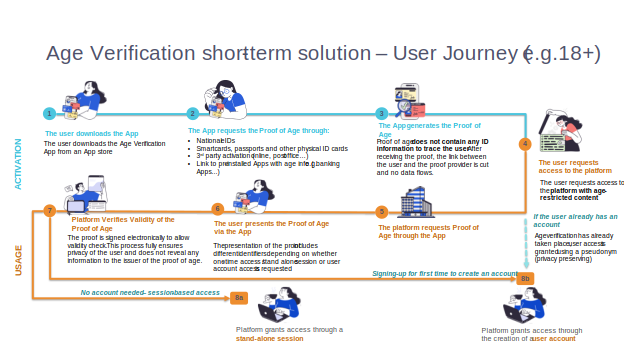
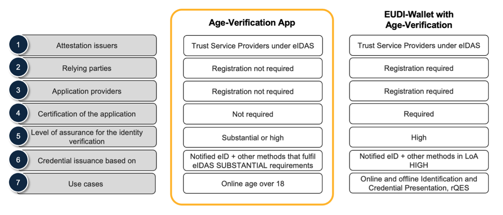
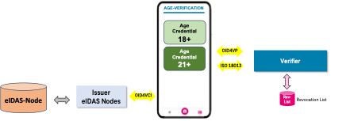
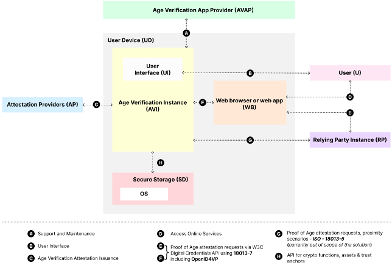
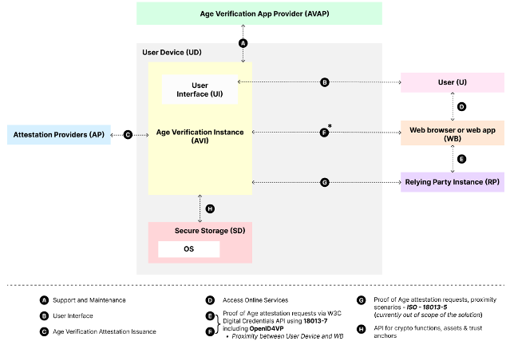
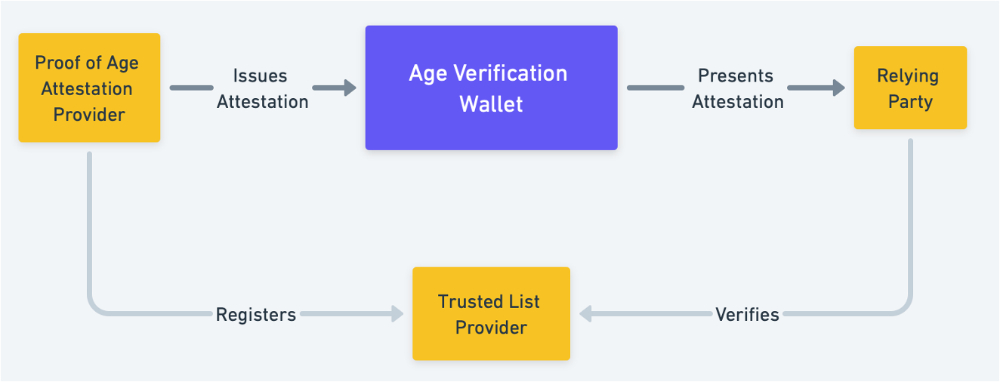
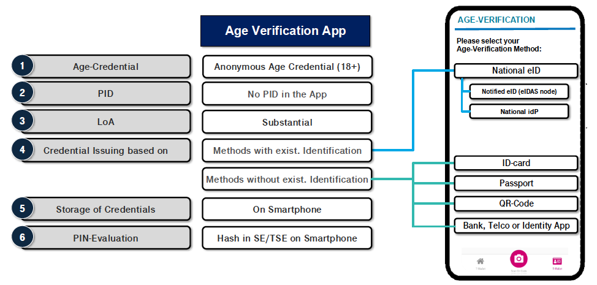
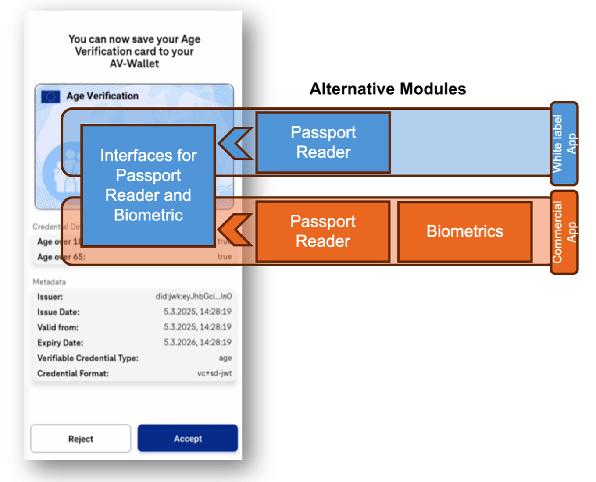

# Operational, Security, Product and Architecture Specifications of the white label application

## 1 Introduction

### 1.1 Context

The primary objective is to develop an EU-wide solution to age verification that reinforces the [Digital Services Act (DSA)](https://eur-lex.europa.eu/eli/reg/2022/2065  ) objective to ensure safe, secure, and trusted digital space—notably Article 28, which focuses on protecting minors—and the [Louvain-la-Neuve Declaration](https://bosa.belgium.be/sites/default/files/content/documents/LLN%20Declaration%20-%20Informal%20Telecom%20Council%20-%20v.12.04.2024.pdf ), which promotes a safer and more trustworthy online environment. The proposed solution is intended to bridge the gap until the EU Digital Identity (EUDI) Wallets become available by the end of 2026, enabling the incorporation of the age verification functionality in them. 
 
As stated in the Louvain-la-Neuve Declaration, "the presence of online harmful content and systemic risks continues to be a major concern as the use of social media, in particular by children, increasingly plays a formative role in their daily lives". Creating a safer, more secure, and trusted digital environment therefore has to be at the heart of Europe’s digital strategy, with a firm commitment to support, empower and respect children online and protect them from harmful content and systemic risks. The Declaration also calls on the European Commission to bring together the tools available under the Digital Services Act (DSA) and the European Digital Identity Wallet, to provide comprehensive safeguards for the users of digital services in the Union, in particular the most vulnerable groups, for example children.    
 
As stated in the study "[Mapping age assurance typologies and requirements](https://data.europa.eu/doi/10.2759/455338)",  age verification solutions provide a high degree of certainty in determining the age of a user. Through this design document we are defining a Europe-wide effective and convenient method to age-gate access to specific online services.  

Age verification plays a crucial role across various scenarios, including:

- Access to online services: Verifying age for online services offering age-restricted content or services, such as adult media, gambling, or other content deemed unsafe for minors.

- Purchases of age-restricted products: Ensuring legal compliance when purchasing products like alcohol or tobacco, both online and in physical stores.

- Age-related benefits: Validating eligibility for discounts or services offered to specific age groups, such as young or elderly individuals.

Given the regulatory priorities and societal needs, this document focuses on age verification for accessing online services with restricted content or services. However the proposed solution defined in this document is not exclusive to this use case but can be used broader in the scenarios mentioned above.
 
The age verification solution will serve as a foundational component of the European Union’s efforts to create a safer digital environment. This document will contribute to the development of a future Age Verification Rulebook, which will be included in the Electronic Attestation Catalogue under the governance of the European Digital Identity Regulation. 
 
By establishing a secure, privacy-preserving, and interoperable framework for age verification, this initiative will empower users, online services, and regulators to uphold digital safety and inclusivity while ensuring compliance with Union law.

### 1.2 Purpose of this document

This document outlines the operational, security, product, and architecture specifications for the Age Verification white label application. Its purpose is to provide a comprehensive framework that ensures the application’s functionality, security, and scalability align with the overall business and technical requirements. 

### 1.4 Definitions

The definitions used in this document can be found in Annex 1 of this document.

### 1.5 Scope

This document defines the structural and functional aspects of the Age Verification ecosystem, detailing its key components and their interactions. It provides a technical foundation to ensure interoperability, security, and privacy, aligning with the relevant regulatory and industry requirements.

This framework serves as a reference for the harmonized implementation of age verification solutions, guiding the development of technical specifications, standards, and operational procedures. These specifications define the end-to-end solution, detailing the entire process—from the issuance of proofs of age to their verification by online services — to ensure interoperability, security, and regulatory compliance.

Annex 3 describes the features included in the Age Verification white label solution that serves as a reference implementation for the Member States and other actors in the ecosystem. The architecture specifications are designed to support the development of a reference implementation for the white-label solution while remaining adaptable to technological and regulatory advancements. 

Annex 4 introduces an Age Verification Profile prioritizing the Age Verification remote and online use case, aiming at achieving equivalence to Level of Assurance (LoA) substantial.
.

### 1.6 Further Enhancements and Open Topics

In this version of the Age Verification architecture, some topics still require further analysis and refinement. These aspects will be examined in collaboration with Member States, civil society, industry representatives, and subject matter experts, to ensure comprehensive stakeholder input.

Among the areas identified for further development are:

- Zero Knowledge Proofs (ZKP)

## 2 Age Verification Solution

The device-based solution will enable age verification to occur securely and efficiently at the device level. Once issued to the device, age-related attestations can be verified by online services in simple, secure ad privacy preserving manner. This will be supported by:

- **Development of open technical specifications**: The European Commission will develop a comprehensive set of open technical specifications for the implementation of the end-to-end solution. These specifications will detail the entire process, from the issuance of proofs of age to their verification by online services. The development will involve close collaboration with all relevant stakeholders, including Member States, industry, and technical experts, to ensure alignment with regulatory requirements, technological capabilities, and user needs. This inclusive approach will foster interoperability and widespread adoption of the solution.

- **Integration with the European Digital Identity Regulation**: The solution will leverage the existing eIDAS infrastructure, including the eIDAS nodes and the trust model of trusted services, to ensure a high level of security and reliability. By aligning with the technical architecture [[ARF](https://eu-digital-identity-wallet.github.io/eudi-doc-architecture-and-reference-framework/)] of the EU Digital Identity Wallet, the solution will provide secure, reusable, and interoperable proofs of age. This approach ensures compliance with EU standards and fosters trust and seamless cross-border functionality.

- **Reference implementation:** A reference implementation, including a white label Age Verification Application, will be provided to support the widespread distribution of age verification applications.

### 2.1 Age Verification Solution Overview

The approach to the design of the age verification solution proposed in this document aims to address the following goals:

-	Possibility to use for access to online services. The focus on a specific use case should contribute to a swifter deployment of the age verification solution. As explained in the introduction, age verification for access to online services is seen as a regulatory priority.
-	Possibility for a quick wide-scale deployment. Design decisions should enable, whenever possible, swift development, integration, and deployment of the solution and make it widely accessible.
-	Possibility to use on all common devices that Europeans use for access to online services. Users should be able to present proof of age when they access online services using all widely used types of devices, such as mobile phones, tablets, laptops and desktop computers. The white label solution will be delivered as a mobile application. Please see annex 3. Eurostat data shows that all these devices are currently widely used by the Europeans, with desktop computers being the least common.
-	Reliance on a device-based Proof of Age. Considering the need for a quick wide-scale deployment, the age verification solution could be based on the use of widely available mobile devices, such as mobile phones or tablets, for storing proof of age. The addition of alternative mechanisms could be planned for later versions of the solution.

In addition, consideration should be given to the fact that in some cases a device can be shared by multiple persons (e.g. a child may have access to their parent’s device such as a mobile phone). Sharing of devices and user accounts is associated with many inherent risks related to privacy, security, misuse, data loss or limited parental controls. The solution may not be capable of addressing all these risks, however possibilities of mitigating some of them are being considered in the design allowing on device user authentication using extra application PIN and also proposing to the Age Verification App Providers to add other alternative factors if they deem it necessary. Such additional mitigation measures are not described in detail in this architecture presentation but may be added to more detailed technical specifications.

The following elements are currently considered out of scope:
-	Possibility to use for purposes other than access to online services. Presentation of proof of age for purchasing age-restricted products, for benefitting from age-related discounts, or for any other purposes is not currently seen as priority. At the same time, where design choices can be made to allow for a more general use of age verification, these use cases can be considered.
-	Proof of Age attestations stored by remote services. Enabling the possibility to use remote services for storing and presenting the proof of age attestations would add further complexity, potentially creating a hurdle for swift wide-scale deployment. Possibility of reliance on remote services could however be considered for later versions of the solution. Whenever possible, selection of technical standards that prevent reliance on such remote services should be avoided.

### 2.2 Design Principles

To enable rapid and reliable deployment of the age verification solution, the solution will adhere to the following approach:

- **Reliance on existing standards**: Where possible prioritise the use of available standards and specifications to expedite development and integration. [[ARF](https://eu-digital-identity-wallet.github.io/eudi-doc-architecture-and-reference-framework/)] should be used as the basic pool of choices for standards.

- **Collaboration with established issuers**: Engage institutions capable of mass-issuing Proof of Age attestations, such as banks, mobile network operators, and governmental population registers.

- **Involvement of key stakeholders**: Partner with actors skilled in app development and eGovernment solutions, including mobile operating system providers, wallet solution providers, and operators of citizen-facing applications.

To ensure a robust and reliable solution, the framework considers the following design principles:

- **Data protection:**

  - **Data minimisation**: Releasing only the necessary user attributes or attribute statements for a specific transaction aligns with the principle of data minimisation. Implementing such a principle requires technologies that inherently restrict data exposure and safeguard user privacy. Furthermore, domain-specific identifiers, or pseudonyms, play a crucial role in advancing data minimisation. These identifiers enable the user to avoid relying on the same unique identifier when they interact with online services.

  - **Unlinkability**: Cryptographic or protocol-level unlinkability should be considered for data minimisation, to ensure that only the identifiers required for specific linkable transactions are disclosed. Protocols that enable default linkability across transactions may violate the principles of data minimisation and compromise privacy. Profiling and tracking of individuals should be avoided. The solution should seek to attain as many types of unlinkability (with respect to attestation providers, relying parties, or both) as possible, while respecting the need for technological practicability.

  - **Storage limitation**: Data should be kept by all involved parties for no longer than necessary for the purposes of age verification.

  - **Transparency**: Users must be provided with clear information about how their personal data is being used.

- **Data security**: User data and credentials are securely stored to ensure their confidentiality, authenticity, integrity, and availability. This robust protection safeguards the data against risks such as unauthorised access, destruction, misuse, alteration, disclosure, or loss.

- **Cloning protection**: Cloning protection safeguards against the unauthorised duplication of credentials and user data. Cloning involves the illicit reproduction of these credentials, potentially granting unauthorised parties privileges they would not otherwise possess.

- **Eavesdropping protection**: Protocols implemented within the age verification solution are designed to safeguard communications, preventing the unauthorised interception and exposure of personal data.

- **Interoperability**: Ensuring seamless integration across diverse device operating systems, wallet applications, and online services. 

- **User binding**: User attributes and credentials must be securely bound to the legitimate user to whom they are issued. This ensures the fundamental functionality of any government-issued document: accurately associating attributes with the individual to whom they apply.

- **User centricity**: In a user-centric system, users maintain control over their attributes and can provide informed consent for their use, whether the attributes are managed locally or remotely by an identity or attribute provider.

- **User experience**: Creating a simple and intuitive process for users to verify their age and share the attestation when required.

- **Compliance**: Aligning with data protection regulations, including GDPR and in particular the data protection by design and by default principle, and adhering to the European Digital Identity Regulation.

- **Equity**: Designing solutions that are accessible and inclusive, ensuring that users with varying technological access or proficiency can participate without barriers. Remedies, such as alternative proof of attestation issuance procedures or human intervention should be considered for cases where some individuals cannot use the mainstream procedure, for example due to a lack of a necessary identity document or electronic identification means.

### 2.3 Data Presentation flows

To be able to prove their age online, the user must install an age verification app on their mobile device. This  Age Verification Solution enables the user to securely and reliably present their proof of age without disclosing additional personal information. For example, the user can demonstrate that they are at least 18 years old without revealing their exact age, name, or any other private details, ensuring privacy and compliance with data protection standards. 

The following picture and description provide a scenario-based sequence of the steps a user takes to accomplish this high-level goal with the age verification solution proposed. This journey unfolds across various channels and over time, illustrating the seamless interaction between the user, the age verification app, and the online service.

<figure>

<figcaption>
<strong>Figure 1</strong> Main steps of the age verification process
</figcaption>
</figure>

The age verification process consists of two main phases: Activation and Use. The steps are illustrated in  Figure 1 and detailed below:

### 2.3.1 Activation of the App

**1.  App installation and registration**

- The user downloads and installs the age verification app on their mobile device.

- If required by the app, notably if it supports multiple user profiles, the user creates a local profile in the app to facilitate subsequent verification processes.

**2.  Requesting a Proof of Age**

- The user requests a Proof of Age from a designated issuer (Age Attestation Provider), which will issue it after verifying the user’s identity at a level of assurance equivalent to "substantial" or "high" pursuant to Commission Implementing Regulation (EU) 2015/1502 through the following methods:

  - Notified or national eID schemes

  - Leveraging existing databases: Identity verification is conducted through recognised and well-established processes already in use for personal identification under national or Union law, such as National identity providers covering the level of assurance.

  - Know Your Customer (KYC) procedures employed by banks or the identity verification methods used for issuing SIM cards by Mobile Network Operators.

  - Document-Based Verification: Confirming the user’s age using official identification documents such as electronic ID cards, passports, or other government-issued credentials. The link between the document and the user should be verified.

**3.  Issuance of Proof of Age**

- Once the user’s age is verified, the app receives a digital Proof of Age attestation.

- This attestation is securely stored within the app and can be used to prove the user’s age to online service or physical retailers.

- Decoupled Issuance Based on Pre-Authorized Codes : The issuance process for a Proof of Age can be also decoupled from the identity verification process. This can be achieved through pre-authorised secure codes provided to the user after successful identity verification or generated on demand by third-party applications, such as banking apps. These codes can then be used to retrieve a valid Proof of Age attestation, enabling a streamlined, flexible, and user-friendly issuance process while maintaining high standards of security and compliance.
    
### 2.3.2 Use of the Age Verification solution

**4.  User requests access to age-restricted services**

- After activation, the user can use the app to present their Proof of Age attestation to access age-restricted content or services (e.g., gambling, adult media, alcohol purchases).

- The user initiates access by requesting a service or content on the target service.

**5.  Service requests Proof of Age**

- The service replies by requesting a Proof of Age, typically through one of the following mechanisms:

  - Same-Device App Integration: The user's browser or a native app opens the age verification app directly (if on the same device).

  - Cross-Device QR Code: The service displays a QR code that the user scans with their mobile device to open the age verification app.

- In addition the possibility for Cross-Device Shareable Links will be analysed, considering possible risks associated with their use. Such a link could be sent by the user to their mobile device, for example using a messaging service.

**6.  Confirmation and presentation**

- The age verification app receives the Proof of Age request and presents it to the user. The user reviews the request details, verifies the information, and confirms the transaction to proceed.

- The app securely transmits the Proof of Age attestation to the service.

**7.  Verification and access**

- The service verifies the Proof of Age by:

  - Checking the attestation's validity and digital signature.

  - Ensuring the attestation's details meet the required criteria (e.g., age threshold).

- If the verification is successful, the service grants the user access to the requested service or product.

**8.  Verification options for subsequent interactions**

- On-Demand Verification (8a): Services may request the Proof of Age each time the user attempts to access restricted content or services, without storing it in any session or account, ensuring privacy and minimising data retention.

- Stored Verification(8b): Services may optionally store information derived from the Proof of Age in the user's account, allowing the user to bypass repeated verification for future visits or purchases, streamlining the user experience. In this case, authentication methods such as WebAuthN should be utilised to ensure secure access while enabling the user to choose and a pseudonym, preserving privacy. Risks in case of the device sharing should be considered.

## 2.4	Roles in the ecosystem

### 2.4.1 User of the Age Verification App (U)

The end user should have full control over the Age Verification App and the mobile device on which it operates. This process requires the user to take active steps to prove their age to an online service. These steps include downloading the Age Verification App, verifying their age with the Attestation Provider, and presenting the attestation when accessing the online service.

### 2.4.2 Proof of Age Attestation Provider (AP)

Natural or legal person that provides the Proof of Age attestation to the user of the age verification application. Providers of the Proof of Age attestation will need to verify that the user is over a certain age to be able to issue the attestation to the user's age verification app. Providers will also need to be included in the trust framework of the solution to allow verifiers check the trustworthiness of the Proof of Age attestation.

### 2.4.3 Age Verification App Provider (AVAP)

Providers of age verification apps are Member States or organisations making the age verification app available for end users. Currently, any mobile application provider would be allowed to provide an age verification app and issue and present Proof of Age attestations in accordance with the requirements contained in this document.

Providers of the age verification apps will be responsible for ensuring compliance of their apps with the requirements defined for the age verification solution.

### 2.4.4 Proof of age verifier, Relying Party (RP)

Natural or legal person that rely on the age verification application to verify the user condition of being over certain age. Verifiers will request a user of an Age Verification App to share a Proof of Age attestation, to grant access to a service. In this specific case verifiers will be online services that need to verify users age to grant access to their services.

## 2.5 Key Differences in between the Age Verification application and the Age Verification functionality in the EUDI Wallet

The Age Verification solution is intended to bridge the gap until the EUDI Wallets become available by the end of 2026, enabling the incorporation of the age verification functionality in them. This chapter describes the key differences between the Age Verification application and the age verification functionality in the EUDI Wallet. 

The trust framework of EUDI Wallet requires that the application is certified, and the application provider is registered. Also, the Relying parties are registered, and the wallet unit needs to be able to authenticate the Relying Party. In the Age Verification application there is no certification or registration need for the application issuers or the relying parties. 

Onboarding of users to the European Digital Identity Wallet will be facilitated by relying on identity proofing process comparable to LoA substantial.

<figure>

<figcaption>
<strong>Figure 2</strong> Differences in trust frameworks depending on the way of making the age verification functionality available.
</figcaption>
</figure>

The AV app is a stand-alone application that provides only the minimum functions. In case of authentication to the national eIDAS node, only the age verification attestation is stored. In this application no other ID data is stored than the ones described in section [data architecture].

<figure>

<figcaption>
<strong>Figure 3</strong> Example: Authenticating
to a national eIDAS node to receive the age verification attestation.
Additional issuing options are available and analytically presented in
the next sections.
</figcaption>
</figure>

#  3. Operational Responsibilities and Governance

## 3.1 White label application 

The Age Verification application will be delivered as a white label application, that can be adapted to national requirements, such as branding. Member States and other Age Verification App Providers will extend to make the solution full in production, deploy, publish and operate the Age Verification solution including the mobile applications and the back-end services.

## 3.2 Lifecycle

It is assumed that the Age Verification app will be a specialized solution and that the age verification functionality may be integrated into the EUDI Wallet in the future.

# 4. Reference Architecture

## 4.1 Architecture Overview

The proposed high-level architecture of the age verification solution is presented in Figure 5 (Same Device) and Figure 6 (Cross Device). The Same Device flow means that the User presents their Proof of Age attestation to a Relying Party interacting with the User (through the web browser or an app) on the same device that the device the Age Verification App Instance (Age Verification App) resides on. The Cross Device flow means that the User presents their Proof of Age attestation to a Relying Party interacting with the User on a different device that the device the Age Verification App resides on. In this case the devices should be in proximity to each other to provide protection against certain attacks.

<figure>

<figcaption>
<strong>Figure 4</strong> Age verification
solution components, interfaces and protocols – Same
Device
</figcaption>
</figure>

<figure>

<figcaption>
<strong>Figure 5</strong> Age verification solution components, interfaces and protocols -- Cross Device
</figcaption>
</figure>

## 4.2 Components of an Age Verification Unit

The following have been identified as the core components of an Age
Verification Unit depicted in figure 4 and figure 5:

- User device (UD): A User Device comprises the hardware, operating   system, and software environment required to host and execute the Wallet Instance. The minimum hardware and software requirements for the User device will be determined by the Member States.

- Age Verification Instance (AVI): The app or application installed on a User device, which is an instance of an Age Verification Application and belongs to and is controlled by a User. This component implements the core business logic and interfaces. It directly interacts with the Secure Storage (see bullets hereafter) to securely manage cryptographic assets and execute cryptographic functions, ensuring adequate assurance for authentication.

- Secure Storage (SD): Through the Secure Cryptographic Interface (SCI) it enables the Age Verification Instance to communicate with the Secure Storage (SD) on the User device. This interface is specifically designed for managing cryptographic assets and executing cryptographic functions. A Wallet Secure Cryptographic Device (WSCD) according to [ARF](https://eu-digital-identity-wallet.github.io/eudi-doc-architecture-and-reference-framework/) may play the role of an SD. The white label age verification app will by default use on device secure storage (local native WSCD [ARF](https://eu-digital-identity-wallet.github.io/eudi-doc-architecture-and-reference-framework/) for ease of Distribution and to drive adoption.

## 4.3 Interfaces and protocols of an Age Verification Unit

The interfaces and their respective protocols illustrated in Figure 4 and Figure 5 are as follows.

a)  The Age Verification App Provider interface (support, and maintenance interface) is used by the Age Verification Instance to communicate with the Age Verification App Provider. The interface is also used to provide support to the user and collect metrics for accounting purposes if the Provider chooses to implement such a service in-app.

b)  The User Interface (UI) is the point of interaction and communication between the User and the Age Verification App.

c)  The Attestation Issuance Interface (AII) is based for example on the OpenID4VCI protocol and is used by the Age Verification App to request the Proof of Age attestation to be stored in Age Verification Unit.

d)  The Web Browser interface is the user interface offered by the Web Browser to the User.

e)  See g)

f)  See g)

g)  The Presentation Interface (PI) empowers Relying Parties to securely request and receive the Proof of Age attestation from the Age Verification Instance, accommodating both remote and proximity interactions. In a remote flow (E, F), when a Relying Party requests the Proof of Age attestation provide access to an online service, the process initiates through either a web browser or a mobile app. For remote presentation flows, the Age Verification Instance implements ISO/IEC 18013-7 that relies on OpenId4VP. The technical specification W3C-DigCred being currently drafted by W3C with participation of mobile operating system and web browser manufacturers may also be part of the technical solution in future versions once it is by default enabled in both operating systems (iOS and Android), to provide a harmonised API for web browsers and mobile apps relying on the Proof of Age attestation. In contrast, for the proximity presentation flow (G), it adheres to the ISO/IEC 18013-5 standard.

h) The Secure Cryptographic Interface (SCI) enables the Age Verification Instance to communicate with the Secure Storage (SD) on the User device. This interface is specifically designed for managing cryptographic assets and executing cryptographic functions.

## 4.4 Data Architecture

The proposed data model for the Proof of Age attestation is described as follows. It is a profile of the attribute schema defined in ISO/IEC 18013-5 and in ISO/IEC 23220-2.

The ISO/IEC 18013-5 standard (Mobile driving licence (mDL) application) defines an attribute schema, data format and proof mechanisms for mDLs:

- Attribute schema defines the structure, logical organisation, type and namespace(s) of the attested attributes as well as additional information such as information about the attestation, its issuer, the verification mechanisms, the underlying identity assurance, the Trust Framework to which the properties are related, and the proof of possession by the legitimate User.

- Data formats define the way data in an attestation is formatted, e.g. its character sets, encoding and serialisation.

- Proof mechanisms define the methods used to secure the attestations for integrity and authenticity, including for selective disclosure.

While the attribute schema has been defined in ISO/IEC 18013-5 specifically for mobile driving licences, the data formats and proof mechanisms can also be used with other attribute schemas. Standard ISO/IEC 23220-2 extends and generalises the schema beyond the mobile driving licence, adding further data elements for personal attributes.

The ISO/IEC 18013-5 and ISO/IEC 23220-2 standards define a set of specific rules for handling the age_over_NN attributes in alignment with the principle of data minimisation. The application of these rules requires specific application logic to be implemented in the wallet or app holding the mobile driving licence, on top of the generic application logic for handling any electronic attestations of attributes such as that implemented in wallet solutions.

No standardised attribute schema has yet been defined specifically for the Proof of Age attestation. However, many elements of the mDL schema and the more generalised set of attributes defined in ISO/IEC 23220-2 can be reused. These also include attributes such as age_in_years, age_birth_year and age_over_NN (defined as optional in mDL), of which particularly age_over_NN is relevant for the age verification solution.

The tables below provide a proposal for the age verification attribute schema. It is a profile of the attribute schema defined in ISO/IEC 18013-5 and in ISO/IEC 23220-2. The proposal should be discussed and agreed with relevant stakeholders, published as part of the Age Verification Rulebook, and possibly standardised by an SDO.

While the mandatory attribute(s) must be present in all Proof of Age attestations the optional attributes would only be included in such an attestation if specifically requested and agreed by the User and the Issuer is capable of verifying and issuing them.

|  **Attribute identifier**  | **Definition**       | **Presence**       | **Encoding format**       |
|:---------------|:--------------|:---------------|:--------------:|
| age_over_18    | Confirming whether the Proof of Age attestation user is currently over the age of 18 (true) or not (false). | Mandatory   | bool      |

**Table 4** Mandatory attribute of the Proof of Age attestation

|  **Attribute identifier**  | **Definition**       | **Presence**       | **Encoding format**       |
|:---------------|:--------------|:---------------|:--------------:|
| age_over_NN    | Confirming whether the Proof of Age attestation user is currently over NN years of age. Multiple entries MAY be provided as separate attributes. Supported values of NN: 13, 15, 16, 21, 23, 25, 27, 28, 0, 60, 65, 67. Age statements for other values of NN are not supported by this schema.| Optional   | bool      |
| portrait    | A reproduction of the Proof of  Age attestation user's portrait. | Optional   | bstr      |

**Table 5** Optional attributes of the Proof of Age attestation

|  **Attribute identifier**  | **Definition**       | **Presence**       | **Encoding format**       |
|:---------------|:--------------|:---------------|:--------------:|
| issue_date    | Date (and if possible time) when the Proof of Age attestation was issued. | Mandatory   | tdate or full-date     |
| expiry_date    | Date (and if possible time) when the Proof of age attestation will expire. | Mandatory   | tdate or full-date      |
| issuing_authority    | Name of the administrative authority that issued the Proof of Age attestation. | Mandatory   | tstr      |
| issuing_country    | Alpha-2 country code, as specified in ISO 3166-1, of the country or territory of the provider of the Proof of Age attestation. | Mandatory   | tstr      |
| issuing_jurisdiction    | Country subdivision code of the jurisdiction that issued the Proof of Age attestation, as specified in ISO 3166-2:2020, Clause 8. The first part of the code shall be the same as the value for the issuing country. | Optional   | tstr      |

**Table 6** Metadata about the Proof of Age attestation

## 4.5 Trust Framework

The Digital Services Act does not contain provisions mandating the trust framework for the age verification ecosystem. Reusing existing trust framework is preferred over establishing and operating a new age verification specific trust framework. Reliance on the trust framework established under the eIDAS Regulation is therefore proposed for the solution.

The trust framework for the Proof of Age attestation is based on trusted lists developed and operated pursuant to Article 22 of the eIDAS Regulation. The trusted lists are available on the [eIDAS Dashboard](https://eidas.ec.europa.eu/efda/home). Proof of Age Attestation Providers should be either qualified or non-qualified trust service providers and they should be published in a trusted list that is made available to the eIDAS Dashboard. Their publication should follow the requirements laid out in Implementing Regulation 2015/1505, and the Trust Anchor defined therein (Service Digital Identifier) should be used by relying parties to validate the attestation.

<figure>

<strong>Figure 6</strong> Trusted List Overview
</figcaption>
</figure>

The registration of Relying Parties that request age verification, or the registration of Age Verification App Providers is not required. Proof of Age Attestation Providers may however set specific conditions as to which apps they can issue such attestations to, and Age Verification App Providers may set similar conditions regarding Relying Parties.

Considering the need for reliability and trust in the age verification solution, a method comparable at least to LoA Substantial should be required as laid out in Implementing Regulation 2015/1502.

### Trusted List solution for the Proof of Age Attestation Providers (PAAP)

It must be decided whether the Proof of Age Attestation Provider (PAAP) requires its own dedicated trust anchor CA.​ Both implementation options are presented below. The final implementation approach will be defined in a later version of this document.

**Option 1 – PAAP with trust anchor CA**

- The PAAP (or an entity acting on its behalf) manages the PKI infrastructure – including software, hardware, and HSM –, establishes a trust anchor CA, generates a key pair, and issues a certificate for signing or sealing the Proof of Age Attestation.​
- The Trusted List Provider/Registrar adds the PAAP’s information and corresponding trust anchor to the Trusted List.​
- For each PAAP, the Trusted List shall include information about the PAAP, together with its associated trust anchor.

<figure>

<strong>Figure 7</strong> Trusted List proposed approach
</figcaption>
</figure>

**Option 2 – PAAP without trust anchor CA**

- The PAAP (or an entity acting on its behalf) generates a key pair for signing or sealing the Proof of Age Attestation, along with a PAAP certificate request.​
- The Trusted List Provider/Registrar operates the AV trust anchor PKI and issues the PAAP certificate for signing or sealing the Proof of Age Attestation (based on the public key contained in the PAAP’s certificate request). Information about the PAAP is made publicly available via the eIDAS Dashboard, with a URL to this information included in the PAAP certificate.​
- The Trusted List shall include only one AV trust anchor.​

<figure>

<strong>Figure 7</strong> Trusted List proposed approach
</figcaption>
</figure>

Comparison table of the options is shown below. 

| Option    | Advantages​ | Disadvantages​ |
| -------- | ------- | ------- |
| Option 1 – PAAP with trust anchor CA​  | The PAAP may either operate its own trust anchor CA or choose a third-party trust anchor CA.  | The Trusted List is expected to be large, as it will include both the trust anchor and corresponding information for each PAAP.​   The validity period of the Trusted List will be short, due to the frequent addition/removal of PAAPs.​   Consequently, Relying Parties will need to update the Trusted List on a daily basis.  |
| Option 2 – PAAP without trust anchor CA | The Trusted List is expected to be very small in size. ​  The validity period of the Trusted List may be relatively long (e.g., one year), allowing Relying Parties to cache the Trusted List locally and download a new version only upon expiration.    |  The Trusted List Provider or Registrar is responsible for operating the AV trust anchor PKI.    Information about the PAAP is not included in the Trusted List; instead, Relying Parties must follow the URL provided in the PAAP certificate to access the relevant PAAP information.    |

## 4.6 Age Proofing in Attestation Issuance Overview

In the following two sections, attestation issuance approaches are introduced grouped in:

- Methods with existing Identification, where only Authentication is needed by the citizen

- Methods without existing Identification, where the citizen needs to provide proof of identification and binding to it.

At a high level, the issuing options are illustrated in the figure below. Sections 4.7 and 4.8 describe issuing options that may be used by Age Verification Apps. At least one of the options must be implemented.

<figure>

<figcaption>
<strong>Figure 8</strong> General architecture for issuing
process choices
</figcaption>
</figure>

## 4.7 Age Proofing in Attestation Issuance: Methods with existing Identification, only Authentication is needed by the citizen

In the approaches below, the age verification unit shall connect to the attestation issuing service.

The age verification app includes functionality to verify user's age based on the national identification scheme.

For this method, the national implementation of the age verification app should be accompanied by an issuing service OpenID4VCI with an attestation formatting module. The Age Verification white label solution includes options for interconnection to (a) Notified eID (eIDAS 1.0 connector configuration), and (b) National iDP (OIDC configuration and SAML configuration) that implementors shall configure (see Annex 3).

*Relevant technical specifications:* 

- Technical specifications on the [eIDAS eID Profile](https://ec.europa.eu/digital-building-blocks/sites/display/DIGITAL/eIDAS+eID+Profile). 
- The eIDAS node [technical documentation](https://ec.europa.eu/digital-building-blocks/sites/display/DIGITAL/eIDAS+eID+Profile ) is publicly available as is the [open-source code for the application](https://ec.europa.eu/digital-building-blocks/sites/display/DIGITAL/eIDAS-Node+version+2.8 ). A web service designed to include the *age_over_nn* attribute has been developed and is available on the EUDI Wallet GitHub space (see [issuer](https://github.com/eu-digital-identity-wallet/eudi-srv-pid-issuer) and [web issuer](https://github.com/eu-digital-identity-wallet/eudi-srv-web-issuing-eudiw-py). 
- Specifications of national electronic identification schemes published by their providers. 

## 4.8 Age Proofing in Attestation Issuance: Methods without existing Identification

In the approaches below, the age verification unit shall connect to the attestation issuing service. but it may not need to connect directly to an existing identity provider service online or to use it fully.

### 4.8.1 Identity Cards and Passports (ICAO 9303)

The Age Verification App should read a physical ID card (smartcard), such as a national ID card, machine-readable passport and another verifiable and trustworthy physical ID card following ICAO Doc 9303 series specifications that can be used to verify the user's age. Implementers should also consider validation services for the documents read as part of the issuing service.

The age verification app should also check link to the user. Implementers should further consider biometric and facial recognition and other remote identity proofing mechanisms for verifying this link to ensure the holder is also the document's owner. (Denoted as biometrics submodule in the figure below). 

This approach may base the generation of the age over nn attestation on the dataset of the document read on the device.

<figure>

<figcaption>
<strong>Figure 9</strong> Age Verification Unit
with interfaces for passport and identity reading &amp; biometric
matching capabilities general approach
</figcaption>
</figure>

The white label app will provide extension interfaces for biometrics and passport reader capabilities​. It will also build an extension module for identity and passport reading based on an open-source module which implements the interfaces​.

*Relevant technical specifications:* 

- ICAO Doc 9303 series (Machine Readable Travel Documents) and standards referenced therein, such as (see next line) 

- ISO/IEC 14443 Identification cards -- Contactless integrated circuit cards -- Proximity cards (ISO/IEC 14443-1, ISO/IEC 14443-2, ISO/IEC 14443-3, ISO/IEC 14443-4) 

### 4.8.2 3rd party activation (out of band)

The Age Verification App can implement an issuance flow that decouples the identity verification step from the generation and delivery of the credential. For example, this can be based on the pre-authorised code flow. With this approach, the identity verification can occur in different ways, such as in a front office setting for example bank, notary, citizen service centre or similar. At the end of the identity verification process, the user would receive an authentication code, for example in the form of a QR code, along with a second-factor verification mechanism based on the information provided during the front office interaction. Such mechanism could be a PIN code, username/password, SMS/email OTP, or similar. Upon completing this procedure, the user would then receive a code to retrieve their age verification proof in their app or wallet.  

*Relevant technical specifications:* 

- OpenID for Verifiable Credential Issuance (Section [3.5.](https://openid.net/specs/openid-4-verifiable-credential-issuance-1_0.html#section-3.5) [Pre-Authorized Code Flow](https://openid.net/specs/openid-4-verifiable-credential-issuance-1_0.html#name-pre-authorized-code-flow)) 

### 4.8.3. Link to pre-installed apps with age info (out of band) 

The Age Verification App can support an issuance flow similar to the "3rd party activation" flow described above, but leveraging third-party applications or websites, such as those of banks or mobile network operators, which already perform identity verification through established mechanisms. The third-party app should be able to generate a pre-authorised code, which can be integrated into the user journey in multiple ways, such as through API calls for app to app or QR codes for cross devices. This flexibility allows for secure and seamless integration with the overall issuance process, while providing options for how users engage with and retrieve their credentials. 

*Relevant technical specifications:* 

- OpenID for Verifiable Credential Issuance (Section [3.5.](https://openid.net/specs/openid-4-verifiable-credential-issuance-1_0.html#section-3.5) [Pre-Authorized Code Flow](https://openid.net/specs/openid-4-verifiable-credential-issuance-1_0.html#name-pre-authorized-code-flow)) 

## 4.9 Attestation revocation and validity period

Attestation revocation is not required in the age verification. Revocation would increase the complexity of the solution for the Proof of Age Attestation providers and for the relying parties.

It is recommended that the Proof of Age Attestation be single-use and remain valid for a period of 3 months from the date of issuance.

In this context, it is important to note that relying parties may not be required to request a new attestation for each transaction, as described in Chapter 2.3.2, Section "8. Verification options for subsequent interactions".

## 4.10 Attestation re-issuance and batch issuance

As Proof of Age Attestations are single-use, the system must support issuance in batches. It is recommended that attestations be issued in batches of 30.

The re-issuance process requires further refinement across different methods:
- If the attestation is issued based on an existing eID, it is recommended that re-issuance is done through reidentification of the user. In practical terms, this implies that the user must re-authenticate at least once every three months when the attestations expire, or more frequently if all attestations are consumed earlier.
- For passport and identity card based issuance, the re-issuance mechanism is still under evaluation. One option under consideration is the use of a token with a validity period of six months, retained by the application. This would reduce the frequency of passport-based re-authentication, requiring it no more than once every six months.
- Re-issuance procedures for other issuance methods will be defined in subsequent iterations of this specification.

## 5 Relevant standards and protocols

For undated references, the latest version available applies.

| **Item Reference** | **Standard name/details**|
|--------------------|-------------------------------------------------------------------------------------------------------------------------------------------|
| [OpenID4VCI] | [OpenID for Verifiable Credential Issuance](https://openid.net/specs/openid-4-verifiable-credential-issuance-1_0.html) |
| [OpenID4VP] | [OpenID for Verifiable Presentations](https://openid.net/specs/openid-4-verifiable-presentations-1_0.html)  |
| [HAIP] | [OpenID4VC High Assurance Interoperability Profile with SD-JWT VC](https://openid.net/specs/openid4vc-high-assurance-interoperability-profile-1_0.html)  |
| [OIDC] | [Final: OpenID Connect Core 1.0 incorporating errata set 2](https://openid.net/specs/openid-connect-core-1_0.html)  |
| [ISO/IEC 18013-5] | [ISO/IEC 18013-5:2021: Personal identification — ISO-compliant driving licence. Part 5: Mobile driving licence (mDL) application. Edition 1, 2021.](https://www.iso.org/standard/69084.html) |
| [ISO/IEC 18013-7] | [ISO/IEC TS 18013-7:2024: Personal identification — ISO-compliant driving licence. Part 7: Mobile driving licence (mDL) add-on functions. Edition 1, 2024.](https://www.iso.org/standard/82772.html)  |
| [ISO/IEC 23220-2] | [ISO/IEC TS 23220-2:2024: Cards and security devices for personal identification — Building blocks for identity management via mobile devices. Part 2: Data objects and encoding rules for generic eID systems. Edition 1, 2024.](https://www.iso.org/standard/86782.html)  |
| [ISO/IEC CD TS 23220-3] | ISO/IEC CD TS 23220-3: Cards and security devices for personal identification — Building blocks for identity management via mobile devices. Part 3: Protocols and services for issuing phase  |
| [ISO/IEC CD TS 23220-4] | [OISO/IEC CD TS 23220-4: Cards and security devices for personal identification — Building blocks for identity management via mobile devices. Part 4: Protocols and services for operational phase.](https://www.iso.org/standard/86785.html)  |

## 6 Annexes

- Definitions - [Annex 1](./annexes/annex-1/annex-1-definitions.md)
- High Level Technical Requirements - [Annex 2](./annexes/annex-2/annex-2-high-level-requirements.md)
- Features of the White Label solution - [Annex 3](./annexes/annex-3/annex-3-features-white-label-app.md)
- AV Profile - [Annex 4](./annexes/annex-4/annex-4-av-profile.md)
