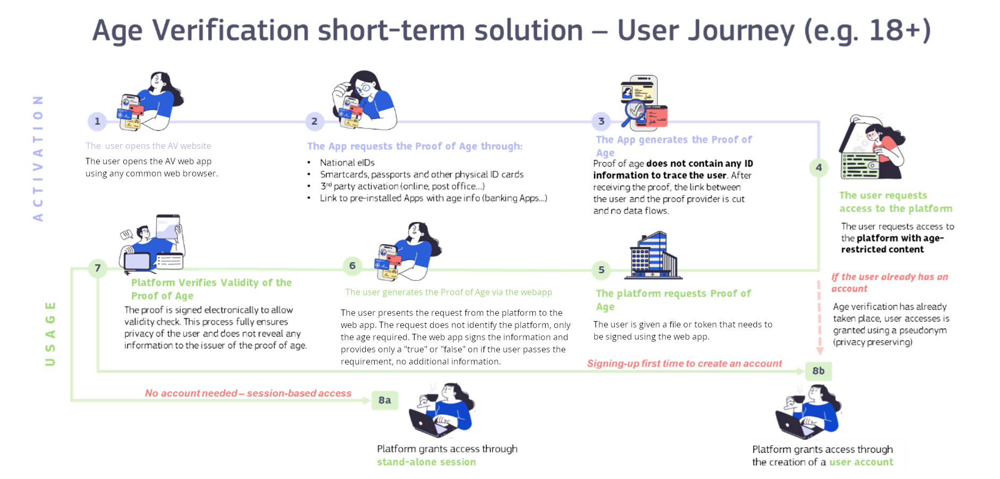
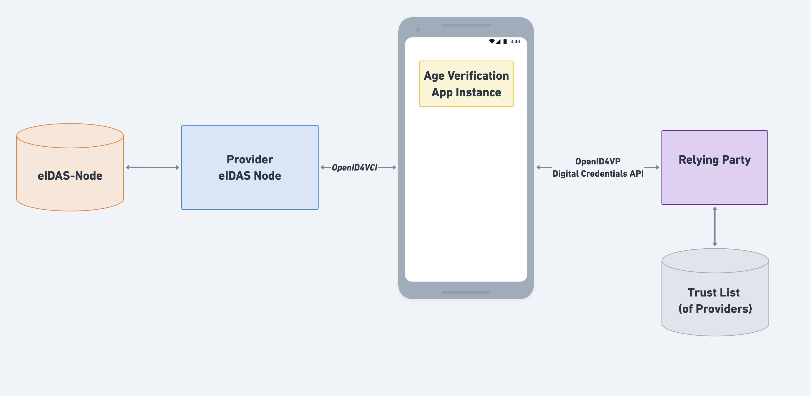

# 1. Introduction

## 1.1 Purpose of this document

The purpose of this document is to provide a comprehensive specification that combines a Software Requirements
Specification (SRS) and an Architecture Description (AD) for the age verification software system for online platforms
to protect minors. The document defines both the functional and non-functional requirements, as well as the system
architecture, with the objective of harmonizing the development of age verification solutions within the EU. This
approach aims to deliver a cross-border solution that minimizes development effort and duplication among Member States,
while fostering synergies.

The structure of this document is based on the relevant IEEE standards, specifically, IEEE 830-1998 for Software
Requirements Specifications and ISO/IEC/IEEE 42010:2022 for Architecture Descriptions, but has been adapted to meet the
specific needs and context of this project.

This document serves as a formal agreement between stakeholders and the development team, ensuring a clear and shared
understanding of the intended system behavior, constraints, and architectural decisions. Furthermore, it provides Member
States and other interested parties with a foundation for implementing systems that are compliant with this
specification.

This document is intended for developers, testers, project managers, and other stakeholders involved in the design,
implementation and validation of software systems for DSA-compliant age verifications.

## 1.2 Scope of this development

This specification defines the structural and functional aspects of the age verification software system for online
platforms. It details the key components, interfaces, and interactions within the age verification ecosystem, providing
a technical foundation to ensure interoperability, security, privacy and compliance with applicable regulatory and
industry requirements.

The scope includes:

- The end-to-end process for issuing, presenting, and verifying proofs of age for access to online services, including
  age-restricted content, products, or services.

- The operational, security, product, and architectural requirements necessary for a harmonized and scalable solution
  that
  can be adopted and extended by Member States or other actors.

- The definition of system boundaries, including the roles of age verification providers, Relying Parties, and users, as
  well as the interactions between these entities.

- The technical requirements for device compatibility, focusing on enabling users to present proof of age across
  commonly
  used devices such as mobile phones, tablets, laptops, and desktop computers.

- The specification of interoperability mechanisms to support integration with existing and future digital identity
  solutions, including the planned incorporation into EU Digital Identity Wallets.

This specification does not cover the internal implementation details of third-party Relying Parties, the development of
alternative age verification methods beyond those explicitly described, or the detailed integration of operational
systems required for an enrollment, as this is subject to country-specific requirements. It serves as a reference for
the harmonized
implementation and certification of age verification solutions across the EU.

This specification builds upon the Architecture and Reference Framework (ARF) for the European Digital Identity (EUDI)
Wallets, adopting the same foundational technical standards and design principles to ensure interoperability, security,
and privacy within the EU digital identity ecosystem. However, it defines only a subset of the requirements and
functionalities compared to a full EUDI Wallet implementation, focusing specifically on the needs of age verification
solutions. The objective is to provide a compatible architecture that facilitates seamless integration and
future-proofing: by aligning with the ARF, this specification enables a clear migration path, so that age verification
services can, in the future, be supported directly by EUDI Wallets as the ecosystem evolves.

## 1.3 Definitions, Acronyms and Abbreviations

For the purposes of the present document, the terms and definitions given in EU Digital Identity Architecture and
Reference Framework Specification and the following apply. A term defined in the present document takes precedence over
the definition of the same term, if any, in EU Digital Identity Architecture and Reference Framework Specification.

### 1.3.1 Definitions

For the purposes of the present document, the following terms and definitions apply:
- **3rd Party Data Sources**: A trusted private data source is a non-governmental, commercially operated entity
  that maintains accurate and verifiable user information, which can be leveraged for age verification purposes (e.g.
  bank, mobile network operators, utility provider).
- **Attestation Provider**: Natural or legal person that provides the Proof of Age attestation to the user of the age verification application.
- **Authentic Source**: A legally recognized and authoritative source from which the Attestation Provider extracts the
  necessary attributes to generate the Proof of Age attestation. Examples include government population registers,
  passport databases or other official registries.
- **Age Verification App**: A unique configuration of an wallet Age Verification Solution 
provider by an Age Verification App Provider to a User seeking to access age-restricted
  content or services. The user requests, receives, and manages their Proof of Age attestation with this app and
  presents the attestation using this app when required to Relying Parties.
- **Age Verification App Instance**: The  Age Verification App installed and configured on a user’s device.
- **Age Verification App Provider**: Providers of age verification apps are Member States or organisations making the age verification app available for end users.
- **Age Verification Solution**: A combination of software, hardware, services, settings, and configurations
- **Implementer**: Αn individual who is responsible for translating software designs, specifications, 
or concepts into functional, operational systems. Presumably this is a contractor of the 
Age Verification App Provider, Proof of Age Attestation Provider or Proof of age verifier. 
- **Proof of age verifier, Relying Party**: Natural or legal person that rely on the age verification application to verify the user condition of being over certain age.
- **Trust Provider**: Operator of an entity or mechanism responsible for maintaining a trusted list (whitelist)
  of all legally authorized attestation issuers. This ensures that verifiers and users can validate the legitimacy and
  authorization of entities participating in the ecosystem.

### 1.3.2 Acronyms and Abbreviations

For the purposes of the present document, the following abbreviations and acronyms apply:

| **Term**           | **Definition**                                               |
|--------------------|--------------------------------------------------------------|
| AP	               | Attestation Provider                                         |
| AV app             | Age Verification application                                 |
| AVI	               | Age Verification App Instance                                |
| AVAP               | Age Verification App Provider                                |
| DG CNECT           | Directorate General Network, Content and Technology          |
| eIDAS              | Electronic Identification, Authentication and Trust Services |
| EUDI               | European Digital Identity                                    |
| EUDIW /EUDI Wallet | European Digital Identity Wallet                             |
| LoA                | Level of Assurance                                           |
| U	                 | User                                                         | 
| RP	               | Relying Party (Proof of Age attestation verifier)            |
| T-Scy              | Scytáles & T-Systems Age consortium                          |
| WB	               | Web Browser (or web app)                                     |
| ZKP                | Zero Knowledge Proof                                         |

## 1.4 Conventions

The terms "SHALL," "SHALL NOT," "MAY", "SHOULD," and "SHOULD NOT" in this document are to be interpreted as
defined in RFC 2119 (Key words for use in RFCs to Indicate Requirement Levels). Their meanings are as follows:

- **SHALL:** Indicates a mandatory requirement; compliance is required.

- **SHALL NOT:** Indicates a mandatory prohibition; compliance is required.

- **SHOULD:** Indicates a recommended requirement; there may exist valid reasons to ignore it in particular
  circumstances, but
  the full implications must be understood and carefully weighed before choosing a different course.

- **SHOULD NOT:** Indicates a recommended prohibition; there may exist valid reasons in particular circumstances when the particular behavior is acceptable or even useful, but the full implications should be understood and the case carefully weighed before implementing any behavior described with this label.

- **MAY:** Indicates an optional requirement; implementation is permitted but not required.

These keywords are used throughout this document to clarify the level of obligation associated with each requirement.

## 1.5 References

### 1.5.1 Normative References

References are classified as either specific (identified by date of publication and/or version number) or
non-specific. For specific references, only the cited version is applicable. For non-specific references, the most
recent version of the referenced document (including any amendments) shall apply.

The following referenced documents are essential for the application of this document.
| **Item Reference**      | **Standard name/details**                                                                                                                                                                                                                                                  |
|-------------------------|----------------------------------------------------------------------------------------------------------------------------------------------------------------------------------------------------------------------------------------------------------------------------|
| [OpenID4VP]             | [OpenID for Verifiable Presentations](https://openid.net/specs/openid-4-verifiable-presentations-1_0-24.html)                                                                                                                                                              |
| [ISO/IEC 18013-5]       | [ISO/IEC 18013-5:2021: Personal identification — ISO-compliant driving licence. Part 5: Mobile driving licence (mDL) application. Edition 1, 2021.](https://www.iso.org/standard/69084.html)                                                                               |
| [ARF]       | [EU Digital Identity Architecture and Reference Framework](https://eu-digital-identity-wallet.github.io/eudi-doc-architecture-and-reference-framework/1.10.0/)                                                                               |

<!---
NF, Add more background about the issue, motivation, etc, Mentions mdoc with respect to ZKP, digital credentials API, security considerations
-->
### 1.5.2 Informative References
<!---
NF, are you sure that all these are informative references? even [ISO/IEC 18013-5],
[OpenID4VCI] is informative, not all issuers have to implement vci
-->

References are classified as either specific (identified by date of publication and/or version number) or
non-specific. For specific references, only the cited version is applicable. For non-specific references, the most
recent version of the referenced document (including any amendments) shall apply.

The documents listed below are not required for the implementation of this document; however, they provide additional
guidance and context on specific subject areas.

| **Item Reference**      | **Standard name/details**                                                                                                                                                                                                                                                  |
|-------------------------|----------------------------------------------------------------------------------------------------------------------------------------------------------------------------------------------------------------------------------------------------------------------------|
| [OpenID4VCI]            | [OpenID for Verifiable Credential Issuance](https://openid.net/specs/openid-4-verifiable-credential-issuance-1_0-ID2.html)                                                                                                                                                 |
| [HAIP]                  | [OpenID4VC High Assurance Interoperability Profile with SD-JWT VC](https://openid.net/specs/openid4vc-high-assurance-interoperability-profile-1_0.html)                                                                                                                    |
| [OIDC]                  | [Final: OpenID Connect Core 1.0 incorporating errata set 2](https://openid.net/specs/openid-connect-core-1_0.html)                                                                                                                                                         |
| [ISO/IEC 18013-7]       | [ISO/IEC TS 18013-7:2024: Personal identification — ISO-compliant driving licence. Part 7: Mobile driving licence (mDL) add-on functions. Edition 1, 2024.](https://www.iso.org/standard/82772.html)                                                                       |
| [ISO/IEC 23220-2]       | [ISO/IEC TS 23220-2:2024: Cards and security devices for personal identification — Building blocks for identity management via mobile devices. Part 2: Data objects and encoding rules for generic eID systems. Edition 1, 2024.](https://www.iso.org/standard/86782.html) |
| [ISO/IEC CD TS 23220-3] | ISO/IEC CD TS 23220-3: Cards and security devices for personal identification — Building blocks for identity management via mobile devices. Part 3: Protocols and services for issuing phase                                                                               |
| [ISO/IEC CD TS 23220-4] | [OISO/IEC CD TS 23220-4: Cards and security devices for personal identification — Building blocks for identity management via mobile devices. Part 4: Protocols and services for operational phase.](https://www.iso.org/standard/86785.html)                              |
| [IETF RFC 2119]         | [Key words for use in RFCs to Indicate Requirement Levels](https://datatracker.ietf.org/doc/html/rfc2119)                                                                                                                                                                  |
| [IEEE 830-1998]         | [Recommended Practice for Software Requirements Specifications](https://standards.ieee.org/ieee/830/1222/)                                                                                                                                                                 |
| [ISO 42010-2022]        | [Software, systems and enterprise — Architecture description](https://www.iso.org/standard/74393.html)                                                                                                                                                                     |

## 1.6 Overview

TODO: describe document structure

# 2. Overall Description of the Age Verification Solution

The primary objective is to develop an EU-wide solution to age verification that reinforces
the [Digital Services Act (DSA)](https://eur-lex.europa.eu/eli/reg/2022/2065  ) objective to ensure safe, secure, and
trusted digital space, notably Article 28, which focuses on protecting minors and
the [Louvain-la-Neuve Declaration](https://bosa.belgium.be/sites/default/files/content/documents/LLN%20Declaration%20-%20Informal%20Telecom%20Council%20-%20v.12.04.2024.pdf ),
which promotes a safer and more trustworthy online environment. The proposed solution is intended to bridge the gap
until the EU Digital Identity (EUDI) Wallets become available by the end of 2026, enabling the incorporation of the age
verification functionality in them.

As stated in the Louvain-la-Neuve Declaration, "the presence of online harmful content and systemic risks continues to
be a major concern as the use of social media, in particular by children, increasingly plays a formative role in their
daily lives". Creating a safer, more secure, and trusted digital environment therefore has to be at the heart of
Europe’s digital strategy, with a firm commitment to support, empower and respect children online and protect them from
harmful content and systemic risks. The Declaration also calls on the European Commission to bring together the tools
available under the Digital Services Act (DSA) and the European Digital Identity Wallet, to provide comprehensive
safeguards for the users of digital services in the Union, in particular the most vulnerable groups, for example
children.

As stated in the study "[Mapping age assurance typologies and requirements](https://data.europa.eu/doi/10.2759/455338)",
age verification solutions provide a high degree of certainty in determining the age of a user. Through this design
document we are defining a Europe-wide effective and convenient method to age-gate access to specific online services.

Age verification plays a crucial role across various scenarios, including:

- Access to online services: Verifying age for online services offering age-restricted content or services, such as
  adult media, gambling, or other content deemed unsafe for minors.

- Purchases of age-restricted products: Ensuring legal compliance when purchasing products like alcohol or tobacco, both
  online and in physical stores.

- Age-related benefits: Validating eligibility for discounts or services offered to specific age groups, such as young
  or elderly individuals.

Given the regulatory priorities and societal needs, this document focuses on age verification for accessing online
services with restricted content or services. However the proposed solution defined in this document is not exclusive to
this use case but can be used broader in the scenarios mentioned above.

The age verification solution will serve as a foundational component of the European Union’s efforts to create a safer
digital environment. This document will contribute to the development of a future Age Verification Rulebook, which will
be included in the Electronic Attestation Catalogue under the governance of the European Digital Identity Regulation.

By establishing a secure, privacy-preserving, and interoperable framework for age verification, this initiative will
empower users, online services, and regulators to uphold digital safety and inclusivity while ensuring compliance with
Union law.

## 2.1 Perspective of the Age Verification Solution

The present document defines a device-based solution that enables secure and efficient age verification. Once age-related attestations are issued to a device, they can be presented and verified by online
services in a simple, secure, and privacy-preserving manner. This capability is supported by the following elements:

- **Open Technical Specifications:**
  A comprehensive suite of open technical specifications has been developed to support the implementation of the
  end-to-end solution. These specifications cover the entire lifecycle, from the issuance of age attestations to their
  verification by online services. Their development involved close collaboration with all relevant
  stakeholders-including
  Member States, industry representatives, and technical experts-to ensure alignment with regulatory requirements,
  technological advancements, and user needs. This inclusive approach promotes interoperability and facilitates broad
  adoption of the solution.

- **Integration with the European Digital Identity Regulation:**
  The solution leverages the existing eIDAS infrastructure, including eIDAS nodes and the trust framework for trusted
  services, to ensure a high level of security and reliability. By aligning with the technical architecture of the EU
  Digital Identity Wallet [ARF](https://eu-digital-identity-wallet.github.io/eudi-doc-architecture-and-reference-framework/), the
  solution delivers secure, reusable, and interoperable proofs of age. This approach ensures compliance with EU
  standards and supports trusted, seamless cross-border functionality.

- **Reference Implementation:**
  A reference implementation, including a white-label Age Verification Application, is provided to facilitate the
  widespread deployment and adoption of age verification solutions.

By ensuring compliance with the standards outlined in the EU Digital Identity Architecture and Reference Framework (
ARF), this solution establishes a foundation for long-term sustainability and interoperability. The Age Verification
Profile, developed within the context of open standards, is designed to be forward-compatible with future EUDI Wallets.
This compatibility is achieved because the reference implementation for Age Verification builds directly upon the EU's
technical specifications and reference implementation for digital identity systems, ensuring architectural alignment.

The modular architecture enables two strategic pathways for Member States:

- **Privacy-Centric Operation:** The Age Verification Application can be deployed as a standalone solution, operating
  independently to minimize data exchange and address specific privacy concerns of users.

- **Seamless Evolution to Full EUDI Wallets:** The solution's design allows for incremental upgrades, where the Age
  Verification Application can later be expanded into a full EUDI Wallet by integrating additional functionalities (
  e.g., qualifications, attestations) as needed.

This dual approach ensures flexibility while maintaining technical coherence with the broader EU digital identity
ecosystem, future-proofing investments and simplifying eventual transitions.

## 2.2 Functions of the Age Verification Solution

The primary function of the solution is the issuance of Proof of Age attestations that can be used across the European
Union. These attestations enable individuals to demonstrate that they meet a specific age threshold, currently focused
on "over 18", to access age-restricted online services and content. The solution is designed to be extensible, allowing
support for other age groups (e.g., "over 14" or "over 65") provided that appropriate enrollment methods are available.

### 2.2.1 Flexible Enrollment Methods

Users have the flexibility to choose from multiple enrollment methods to obtain their Proof of Age attestation.
Supported methods include, but are not limited to:

- Scanning or reading an electronic identity card (eID) or a passport
- Using existing identification systems provided by 3rd party providers or apps
- Other secure identity verification processes as defined by Member States

These enrollment methods ensure that the attestation is based on reliable and verifiable identity documents. Where
necessary, enrollment can also be conducted on-site to accommodate users who may not have access to electronic
identification means.

Member States and solution providers retain the autonomy to determine which enrollment options they offer within the age
verification solution. This flexibility acknowledges the diversity of national identification systems, regulatory
environments, and user needs across the European Union.

### 2.2.2 Presentation of a Proof of Age attestation

The solution enables users to present their Proof of Age attestation to Relying Parties, primarily for online use cases.
The system is optimized for secure and privacy-preserving online presentation, allowing users to prove their eligibility
without disclosing unnecessary personal information. In addition to online scenarios, the solution in principle can also
be adapted to support offline or proximity-based presentations, where attestations can be verified locally.

### 2.2.3 Revocation and Re-Issuance
In its current form, the solution does not support revocation or re-issuance. 
Adding support for these features would introduce additional complexity, which could 
hinder the rapid adoption of the solution. 

### 2.2.4 Verifiable across Europe

A Trusted List is maintained as part of the solution, allowing Relying Parties and users to validate which entities are
legally authorized to issue Proof of Age attestations. This enhances trust and interoperability across Member States by
ensuring that only recognized authorities participate in the issuance process.

### 2.2.5 Note about the extensibility of the solution (for distributors):

While the current implementation focuses on the "over 18" age threshold, the technical architecture supports extension
to other age groups as required by regulatory or business needs. The same applies also to additional enrollment
options. The only prerequisite is the availability of a suitable enrollment process for the target age group, which can
be also adapted or conducted on-site if necessary.

## 2.3 User Characteristics

The primary users of the system are citizens of EU Member States who wish to demonstrate that they have reached the age
of majority. Secondary users of the solution include immigrants, tourists within the EU, and business travelers.

## 2.4 User Journey

To enable online age verification, the user is required to install an AV app on their mobile
device. This AV app  allows the user to securely and reliably present proof of age without disclosing
any unnecessary personal information. For instance, the user can demonstrate that they meet a minimum age
requirement-such as being at least 18 years old-without revealing their exact age, name, or other sensitive details.
This approach ensures both privacy and strict adherence to applicable data protection standards.

The following illustration and accompanying description outline a scenario-based sequence of the steps a user undertakes
to achieve this objective using the proposed age verification solution. This user journey spans multiple channels and
points in time, highlighting the seamless interaction between the user, the AV app, and the online
service.

<!---
NF, Is the picture correct? Specifically step 2
-->

*Figure 1: User Journey of an Proof of Age attestation user*

The age verification process consists of two main phases: Activation and Use. The steps are illustrated in Figure 1 and
detailed below:

**Activation** 

*App installation and registration (step 1)*

- The user downloads and installs the AV app on their mobile device.

- If required by the app, notably if it supports multiple user profiles, the user 
creates a local profile in the app to facilitate subsequent verification processes.

*Requesting a Proof of Age attestation (step 2)*

- The user requests a Proof of Age attestation from a designated AP, which will issue it after
  verifying the user’s identity at a level of assurance equivalent to "substantial" or "high" pursuant to Commission
  Implementing Regulation (EU) 2015/1502 through the following methods:

    - Notified or national eID schemes

    - Leveraging existing databases: Identity verification is conducted through recognised and well-established
      processes already in use for personal identification under national or Union law, such as National identity
      providers covering the level of assurance.

    - Know Your Customer (KYC) procedures employed by banks or the identity verification methods used for issuing SIM
      cards by Mobile Network Operators.

    - Document-Based Verification: Confirming the user’s age using official identification documents such as electronic
      ID cards, passports, or other government-issued credentials. The link between the document and the user should be
      verified.

*Issuance of Proof of Age attestations (step 3)*

- Once the user’s age has been verified, the AP may either issue the attestation directly to the user's AVI or generate a pre-authorized code and provide it to the user as part of a credential offer. At a later stage, the user can present this credential offer through their AVI to obtain the Proof of Age attestation

- This attestation is securely stored within the AVI and can be used to prove the user’s age to online services.

**Usage**

*User requests access to age-restricted services (step 4)*

- After activation, the user can use the AVI to present their Proof of Age attestation to access age-restricted content
  or services (e.g., gambling, adult media, alcohol purchases).

- The user initiates access by requesting a service or content on the RP.

*Service requests Proof of Age attestation (step 5)*

- The RP replies by requesting a Proof of Age, typically through one of the following mechanisms:

    - Same-Device App Integration: The user's browser or a native app opens the AVI directly (if on the
      same device).

    - Cross-Device QR Code: The RP displays a QR code that the user scans with their mobile device to open the AVI.

*Confirmation and presentation (step 5)*

- The AVI receives the Proof of Age request and presents it to the user. The user reviews the request
  details, verifies the information, and confirms the transaction to proceed.

- The AVI securely transmits the Proof of Age attestation to the RP.

*Verification and access (step 6)*

- The RP verifies the Proof of Age attestation by:

    - Checking the attestation's validity and digital signature.

    - Ensuring the attestation's details meet the required criteria (e.g., age threshold).

- If the verification is successful, the RP grants the user access to the requested service or product.

*Verification options for subsequent interactions(steps 8a/8b)*

- On-Demand Verification (8a): RPs may request the Proof of Age each time the user attempts to access restricted
  content or services, without storing it in any session or account, ensuring privacy and minimising data retention.

- Stored Verification(8b): RPs may optionally store information derived from the Proof of Age attestation in the user's
  account, allowing the user to bypass repeated verification for future visits or purchases, streamlining the user
  experience. In this case, authentication methods such as WebAuthN should be utilised to ensure secure access while
  enabling the user to choose a pseudonym, preserving privacy. Risks in case of the device sharing should be
  considered.

## 2.5 Design principles

To enable rapid and reliable deployment of the age verification solution, the solution adheres to the following
approach:

- **Reliance on existing standards:** Where possible, it prioritizes the use of available standards and specifications
  to expedite development and integration.
  The [ARF](https://eu-digital-identity-wallet.github.io/eudi-doc-architecture-and-reference-framework/) serves as the
  primary pool of standards.

- **Collaboration with established APs:** The solution engages institutions capable of mass-issuing Proof of Age
  attestations, such as banks, mobile network operators, and governmental population registers.

- **Involvement of key stakeholders:** The solution partners with actors skilled in app development and eGovernment
  solutions, including mobile operating system providers, wallet solution providers, and operators of citizen-facing
  applications.

Furthermore, to ensure a robust and reliable solution, the framework is driven by the following design principles:

- **Data protection:**
    - **Data minimisation:** Only the necessary user attributes or attribute statements for a specific transaction are
      released, in accordance with the principle of data minimisation. This is achieved by implementing technologies
      that inherently restrict data exposure and safeguard user privacy. Domain-specific identifiers, or pseudonyms, are
      used to enable users to avoid relying on the same unique identifier when interacting with online services.
    - **Unlinkability:** The goal of the solution is to prevent user profiling and 
    tracking by avoiding linkable transactions. Initially, the solution will rely 
    on batch issuance to protect users from colluding RPs. At a later stage, 
    Zero-Knowledge Proof (ZKP) mechanisms will be considered to offer protection 
    - **Storage limitation:** Data is retained by all involved parties only for as long as necessary for the purposes of
      age verification.

    - **Transparency:** Users receive clear information about how their personal data is used.
- **Data security:** User data and credentials are securely stored to ensure confidentiality, authenticity, integrity,
  and availability. This protection safeguards data against unauthorized access, destruction, misuse, alteration,
  disclosure or loss.
- **Cloning protection:** Cloning protection prevents the unauthorized duplication of credentials and user data. This
  measure ensures that illicit reproduction of credentials does not grant unauthorized parties privileges they would not
  otherwise possess.

- **Eavesdropping protection:** The protocols implemented within the age verification solution 
leverage secure communications channels preventing unauthorized interception and exposure of personal data.

- **Interoperability:** The solution ensures seamless integration across diverse device operating systems, wallet
  applications, and online services.

- **User binding:** User attributes and credentials are securely bound to the legitimate user to whom they are issued.
  This ensures the fundamental functionality of any government-issued document: accurately associating attributes with
  the individual to whom they apply.

- **User centricity:** The system is user-centric, allowing users to maintain control over their attributes and provide
  informed consent for their use, whether the attributes are managed locally or remotely by an identity or attribute
  provider.

- **User experience:** The solution provides a simple and intuitive process for users to verify their age and share
  attestations when required.

- **Compliance:** The solution aligns with data protection regulations, including GDPR, particularly the principles of
  data protection by design and by default, and adheres to the European Digital Identity Regulation.

- **Equity:** The solution is designed to be accessible and inclusive, ensuring that users with varying levels of
  technological access or proficiency can participate without barriers. Remedies, such as alternative attestation
  issuance procedures or human intervention, are available for cases where individuals cannot use the mainstream
  procedure, for example due to a lack of necessary identity documents or electronic identification means.

## 2.6 Assumptions and Dependencies

This specification operates under the following foundational assumptions:

### 2.6.1 Legal Compliance in Member States

It is assumed that EU Member States have established appropriate legal frameworks to authorize the collection and
processing of data required for issuing Proof of Age attestations. This includes compliance with GDPR, the Digital
Services Act (DSA) , and national laws governing identity verification and age-restricted services. The enrollment
methods (e.g., eID, passport scans) rely on these legal bases to ensure lawful data handling.

### 2.6.2 Deployment Responsibility

Member States or third-party entities are responsible for deploying the age verification solution in their
jurisdictions. The solution is provided as a white-label, open-source implementation, enabling customization to meet
national legal, technical, and security requirements. No operational responsibility is retained by the project
consortium.

### 2.6.3 Open-Source Implementation

The project exclusively provides an open-source reference implementation via public repositories (e.g., published on
GitHub). Member States and third parties are responsible for hosting, maintaining, and adapting the solution to their
infrastructure.

### 2.6.4 Alignment with EU Digital Identity Architecture

The solution assumes ongoing development of the EU Digital Identity Wallet’s Architecture and Reference
Framework (ARF). By adhering to the ARF’s evolving specifications, the age verification solution ensures
interoperability with future EU Digital Identity Wallets and leverages synergies in trust frameworks, cryptographic
standards, and governance models.

### 2.6.5 National Adaptations

Member States are responsible for modifying the solution to align with national legal requirements (e.g., age
thresholds, data retention policies) and security standards (e.g., certification of issuers, encryption protocols). The
specification provides modular components to facilitate these adaptations without compromising interoperability.

## 2.7 Key Differences in between the Age Verification application and the Age Verification functionality in the EUDI Wallet

The Age Verification solution is intended to bridge the gap until the EUDI Wallets become available by the end of 2026,
enabling the incorporation of the age verification functionality in them. This section describes the key differences
between the Age Verification application and the age verification functionality in the EUDI Wallet.

The trust framework of EUDI Wallet requires that the Wallet Solution is certified, and the Wallet Solution provider is
registered. Also, the Relying Parties are registered, and a Wallet Unit needs to be able to authenticate the Relying
Party. In the Age Verification application there is no certification or registration need for the Age Verification App providers or
the Relying Parties.

Onboarding of users to the European Digital Identity Wallet will be facilitated by relying on identity proofing process
comparable to LoA high.

*Figure 2: Differences in trust frameworks depending on the way of making the age verification functionality available.*

The AV app is a stand-alone application that provides only the minimum functions. In case of authentication to the
national eIDAS node, only the age verification attestation is stored. In this application no other ID data is stored
than the ones described in section [data architecture].

*Figure 3: Authenticating
to a national eIDAS node to receive the age verification attestation.
Additional issuing options are available and analytically presented in
the next sections.*

# 3.  Age verification Solution High Level Requirements

## 3.1 Age Verification App 

This section defines requirements, that applies to the Age Verification App:

- An Age Verification App SHALL implement the protocols specified in Annex A.
- An Age Verification App made available as a mobile application SHOULD be published on the App Stores for Android and iOS operating systems and MAY be published on other App Stores (e.g. Huawei, Samsung).
- An Age Verification App is provided as a stand-alone app separate from the European Digital Identity Wallet, its Age Verification App Provider SHOULD strive for equivalence with Level of Assurance "Substantial" pursuant to Commission Implementing Regulation (EU) 2015/1502.
- An Age Verification App MAY include initialisation functionality that is required for the use of the app.
- An Age Verification App MAY verify that an an Attestation Provider is included on the age verification trust
  list and is therefore authorized.
- An Age Verification App SHALL NOT store any attestation other than the Proof of Age attestation.
- An Age Verification App SHALL rely when possible on the device's native cryptographic hardware.
  capabilities, such as the Secure Enclave on iOS, or the Trusted Execution Environment (TEE) and Strongbox on Android.
- An Age Verification Instance SHALL authenticate its User in a reliable manner (e.g. using a password, PIN code, biometric verification, pattern) before presenting the Proof of Age attestation.

## 3.2 Proof of Age attestation 

This section lists the requirements to be met by the Proof of Age attestation:

- The Proof of Age attestation SHALL comply with the data model set in Section 4.5

## 3.3 Attestation Provider

This section lists the requirements to be met by Attestation Providers:
- An Attestation Provider SHALL implement the protocols specified in Annex A.
- An Attestation Provider SHALL issue Proof of Age attestations that comply with the data model set in Section 4.5
- An Attestation Provider SHALL register with the Federation Authority to obtain proper authorization for issuing proof of age
  attestations.
- An Attestation Provider SHOULD be a qualified or non-qualified trust service provider (TSP) registered in the eIDAS dashboard as a provider of certificates for electronic signature in accordance with Article 22 of 2014/910.
- An Attestation Provider SHALL NOT issue a Proof of Age attestation before verifying the attestation subject's age at
  the Level of Assurance 'substantial' or 'high'.

## 3.4 Relying Party

This section lists the requirements to be met by Relying Parties:
- A Relying Party  SHALL implement the protocols specified in Annex A
- A Relying party SHALL accept Proof of Age attestations that comply with the data model set in Section 4.5 
- A Relying Party SHALL validate the authenticity and the integrity of a presented Proof of Age attestation.
- A Relying Party SHALL validate that the Attestation Provider of a presented Proof of Age attestation is authorized to issue Proof of Age attestations using the Trusted List provided by the Commission.
- A Relying Party SHALL evaluate that a presented Proof of Age attestation.

## 3.4 Trusted list

- The Commission SHALL deploy and manage Trusted Lists (ETSI) of Attestation Providers

# 4. Architecture
The age verification solution defined in this document is guided by several key
objectives. First and foremost, the solution is intended to support access to online services, which is identified as a
regulatory priority. By focusing on this specific use case, the deployment of the age verification solution can be
accelerated, ensuring that it meets urgent regulatory needs while maintaining the potential for future expansion.

A further goal is to enable rapid and wide-scale deployment. Design decisions are made to support swift development,
integration, and rollout of the solution, making it broadly accessible across the European Union. To ensure inclusion,
the solution is designed for compatibility with all common devices used by Europeans to access online services,
including mobile phones, tablets, laptops, and desktop computers. The primary delivery channel will be a white-label
mobile application.

The solution relies on a device-based proof of age model, leveraging widely available mobile devices such as smartphones
and tablets to store age attestations. This approach supports the goal of rapid deployment and broad accessibility.
Alternative mechanisms for storing and presenting proof of age may be considered for future versions of the solution.

It is also recognized that devices may be shared among multiple users, for example, when a child has access to a
parent’s mobile phone. Such scenarios introduce risks related to privacy, security, misuse, data loss, and limited
parental controls. While the solution may not be able to address all these risks comprehensively, mitigation strategies
are being considered. These include implementing user authentication at the application level, such as requiring an
additional PIN, and encouraging Age Verification App Providers to incorporate further authentication factors as needed.
Although these mitigation measures are not described in detail in this architecture overview, they may be elaborated in
subsequent technical specifications.

Certain elements are currently considered out of scope. Specifically, the use of the solution for purposes other than
access to online services-such as for purchasing age-restricted products, obtaining age-related discounts, or other
applications - is not a current priority. However, where feasible, design choices that allow for broader applicability
of
age verification may be considered. 

Additionally, the storage of Proof of Age attestations by remote services is
excluded from the initial scope, as this would add complexity and potentially hinder rapid deployment. The possibility
of utilizing remote services for attestation storage may be revisited in future iterations, but, for now, technical
standards that necessitate such reliance should be avoided.

In summary, the defined technical architecture design aims to balance regulatory compliance and practical deployment
considerations, while remaining adaptable for future enhancements and broader use cases.

## 4.1 Overview

The following figure illustrates the different entities within an age verification system and their
relationships to each other. The subsequent section provides a detailed definition of each interface.

All entities shown in blue are provided by the toolbox, at minimum as mock services. Entities marked in green represent
existing governmental entities. Entities marked in yellow are proprietary. A solution implementation does not
necessarily need to include all components.

**The figure has to be updated**
<!---
NF, Check figure numbering
-->

*Figure 4: Overview of the Age Verification Solution architecture*

## 4.2 Entities

The age verification solution involves several key entities, each with distinct roles and responsibilities to
ensure secure, interoperable, and privacy-preserving verification of age attributes across digital services.
- **3rd Party Data Sources**: A trusted private data source is a non-governmental, commercially operated entity
  that maintains accurate and verifiable user information, which can be leveraged for age verification purposes (e.g.
  bank, mobile network operators, utility provider).
- **Attestation Provider**: Natural or legal person that provides the Proof of Age attestation to the user of the age verification application. The Attestation Provider maintains an attestation issuance service responsible for generating and issuing proof of age attestations. The Attestation Provider validates the user’s age using authentic and trusted information
  sources, such as national identity registers, passports, or other official documents, or trusted 3rd party data
  sources before creating a digitally signed attestation that certifies the user meets the required age threshold.
 Attestation Providers will also need to be included in the trust list of the solution to allow Relying Parties check the trustworthiness of the Proof of Age attestation.
- **Authentic Source**: A legally recognized and authoritative source from which the Attestation Provider extracts the
  necessary attributes to generate the Proof of Age attestation. Examples include government population registers,
  passport databases or other official registries.
- **Age Verification App**: A unique configuration of an wallet Age Verification Solution 
provider by an Age Verification App Provider to a User seeking to access age-restricted
  content or services. The user requests, receives, and manages their Proof of Age attestation with this app and
  presents the attestation using this app when required to Relying Parties.
- **Age Verification Instance**: A instance of an Age
  Verification App installed on the User's device that belongs to and is controlled by a User. 
- **Age Verification App Provider**: Providers of age verification apps are Member States or organisations making the age verification app available for end users. Currently, any mobile application provider would be allowed to provide an age verification app and receive and present Proof of Age attestations in accordance with the requirements contained in this document. Providers of the age verification apps will be responsible for ensuring compliance of their apps with the requirements defined for the age verification solution.
- **Age Verification Solution**: A combination of software, hardware, services, settings, and configurations
- **Proof of age verifier, Relying Party**: Natural or legal person that rely on the Age Verification application to verify the user condition of being over certain age. A Relying Party requests and validates the proof of
  age attestation presented by the Age Verification app instance, ensuring it is authentic and meets the necessary
  criteria. 
- **Trust Provider**: Operator of an entity or mechanism responsible for maintaining a trusted list (whitelist)
  of all legally authorized attestation issuers. This ensures that verifiers and users can validate the legitimacy and
  authorization of entities participating in the ecosystem.

### 4.2.1 Interaction Overview

- The user initiates an age verification process by enrolling with an Attestation Provider (AP), which collects the necessary
  evidence from authentic sources or trusted 3rd party privater data sources.

- The AP generates a Proof of Age attestation and issues it to the Age Verification App Instance (AVI)
oc the user.

- The AVI presents the attestation to a Relying Party (RP) when attempting to access
  age-restricted services.

- The RP checks the validity of the attestation, referencing the trusted list to confirm the AP's
  authorization.

The architecture of the age verification solution considers two flows: Same Device (figure 3) and Cross
Device flow (figure 4) . The Same Device flow means that the User presents their Proof of Age attestation to a Relying Party
interacting with the User (through the web browser or an app) on the same device that the device the Age Verification
App Instance (Age Verification App) resides on.

*Figure 5: Age verification solution components, interfaces and protocols – Same Device*

The Cross Device flow means that the User presents their Proof of Age
attestation to a Relying Party interacting with the User on a different device that the device the Age Verification App
resides on. In this case the devices should be in proximity to each other to provide protection against certain attacks.

*Figure 6: Age verification solution components, interfaces and protocols – Cross Device*

## 4.3 Interfaces
The following interfaces are considered by the Age Verification Solution:

### 4.3.1 Authentic Source and Attestation Provider interface

Communication flows between an Authentic Source (e.g., government register, trusted private entity) and an AP

#### Interface Characteristics

- **Proprietary Design:** This communication interface is proprietary, allowing implementers to customize integration based on
  organizational or national requirements.
- **Integration Methods:**
    - HTTP-based APIs: For modern systems, RESTful APIs over HTTPS are supported, ensuring secure data transmission.
    - Legacy System Adapters: A library or middleware component is provided to interface with legacy systems.
- **Complexity:** Typically, a separate issuer must be provided for each authentic or trusted third-party data source,
  as each issuer is required to implement a distinct business process tailored to the respective data source.

### 4.3.2 Attestation Provider and Age Verification App Instance interface
This interface is used by the AVI to communicate with the AP in order to receive
a Proof of Age attestation. 

#### Protocol Implementation

- OpenID4VCI Compliance: This interface is implemented using the OpenID for Verifiable Credential Issuance (OpenID4VCI)
  protocol, ensuring standardized, interoperable credential exchange across issuers and applications (see also Annex A).
- Multi-AP Support: An Age Verification app can interface with any APs supporting OpenID4VCI, enabling users
  to obtain attestations from diverse  providers (e.g., national eID schemes, banks, or mobile operators).

#### Compliance
This implementation aligns with the EU Digital Identity Wallet's Architecture and Reference Framework (ARF) , ensuring
cross-border interoperability while allowing Member States to maintain control over authorized issuers through
national trusted lists.

### 4.3.3 Age Verification App Instance and Relying Party interface
This interface empowers RPs to securely request and receive α Proof of Age 
attestation from an AVI, accommodating both remote and proximity interactions.

#### Protocol Implementation

- OpenID4VP Compliance: This interface is implemented using the OpenID for Verifiable Presentations (OpenID4VP) protocol,
  ensuring standardized and interoperable presentation of verifiable credentials (see also Annex A).
- Multi-Relying Party Support: The verification application can interact with multiple Relying Parties (verifiers),
  presenting any number of Proof of Age attestations as required. All such interactions are conducted exclusively via
  the Rp interface.

#### Key Features

- Interoperability: By adopting OpenID4VP, the solution guarantees compatibility with a wide range of verifiers and
  Relying Parties across different domains and jurisdictions.
- Flexible Presentation: Users can present one or more Proof of Age attestations to various verifiers, supporting
  diverse use cases and regulatory requirements.

### 4.3.4 Attestation Provider and Trust Provider interface

To distinguish authorized AP from unauthorized one, all APs MUST be registered with the
EU and included in a centrally maintained trusted list. This registration process ensures compliance with EU regulatory,
technical, and security standards.

<!---
NF, Is the registration interface proprietary?  Shouldn't be provided by the commission?
-->
The registration interface follows a proprietary design.

### 4.3.5 Relying Party and Trust Provider interface

An RP can use an HTTP GET Method to retrieve the trusted list.

## 4.4 Supported Enrollment Configurations
To achieve Level of Assurance "Substantial", the enrolment process must provide a 
reasonable degree of confidence in the claimed identity, balancing security with usability. 
The identity proofing must rely on notified eID means or on  evidence based on official documents 
(such as a passport, national ID card, or equivalent), but it does not necessarily 
require in-person presence. Remote identification procedures may be used, provided 
that they ensure the reliability of the process and protect against impersonation and manipulation.

At this level, identity verification may include automated or manual checks of the 
identification document, cross-checks with authoritative sources (e.g., population registries), 
and verification that the person presenting the identity is its rightful holder. 

The enrolment process must still ensure that identity data is collected and verified 
securely, and that it is resistant to common attacks (e.g., document forgery, replay attacks, 
and social engineering). Auditability, traceability, and appropriate risk management measures are also expected.

In the following two sub-sections, attestation issuance approaches are introduced grouped in:

<!--- 
JM - the names of these methods are not well chosen.
--->
- Methods with existing Identification, where only Authentication is needed by the citizen
- Methods without existing Identification, where the citizen needs to provide proof of identification and binding to it.

At a high level, the issuing options are illustrated in the figure below. At least one of the options must be
implemented.

<!---
JM - I don't understand this figure.
--->

*Figure 7: Enrollment options with and without existing identification.*
The above architecture diagram is a functional diagram. For examples of physical mappings, see next clause.

### 4.4.1 Enrollment Methods with existing Identification
To achieve Level of Assurance "Substantial", enrolment processes can effectively 
leverage existing identification mechanisms that have already been verified to 
meet substantial (or higher) assurance levels. This includes the use of notified 
eID schemes under eIDAS, accessed through eIDAS nodes, or integration with national 
Identity Providers (IdPs) that offer authentication at a substantial level. 

When a user authenticates via one of these methods, the identity proofing has already 
been conducted by a recognized authority in accordance with applicable standards, 
allowing the Attestation Provider to reuse this assurance level for enrolment. 
This approach simplifies the onboarding process while maintaining compliance with eIDAS LoA 
Substantial requirements. 

#### Key Components

1. Notified eID Schemes

   Notified eID schemes are electronic identification systems that have been officially notified by a Member State under the eIDAS Regulation and published by the European Commission. These schemes have undergone an assessment process confirming that they meet specific requirements for security, reliability, and assurance levels. 
   
   For an Attestation Provider, integrating notified eID schemes at LoA "substantial" or "high", enables a streamlined and compliant identity proofing process, as the responsibility for identity verification lies with the Member State authority that operates the scheme. 

2. eIDAS Nodes

   Cross-border authentication is facilitated via eIDAS nodes, which act as gateways between notified national eID schemes and
   Relying Parties (e.g., service providers). These nodes ensure secure, standardized communication and data exchange.

3. National IdPs 

   Member States’ national Identity Providers (IdPs) that offer authentication services with legal value within their jurisdiction are a valid and reliable source of identity for enrolment processes. These IdPs typically operate under national legal frameworks and may be aligned with or integrated into notified eID schemes under eIDAS.

#### Authentication Workflow
<!---
NF, "returns the eIDAS Minimum Data Set to the **issuing party**". Is that correct? Does it mean to the app?
JM - it should never return the minimum data set - the AP does only need to know the date of birth, so that he can issue the proof of age attestation. 
-->
- The user initiates enrollment by selecting their national eID scheme.
- The AP redirects the authentication request to the relevant eIDAS node.
- The national eID scheme authenticates the user and returns the date of birth to the iAP.

#### Technical Standards
- SAML 2.0: Used for authentication requests and responses between eIDAS nodes and APs.
- eIDAS Cryptographic Requirements: Compliance with TS 119 461 for identity proofing and cryptographic protocols.

#### Compliance

<!---
JM - the Attestation provider only needs to know the date of birth. 
-->
- Data Minimization: Only the date of birth is transmitted, avoiding unnecessary personal data exposure.
- GDPR Alignment: Enrollment processes adhere to GDPR principles, including user consent and purpose limitation.

<!---
NF, Do we need this section? 
-->
#### *Relevant technical specifications:*

- Technical specifications on
  the [eIDAS eID Profile](https://ec.europa.eu/digital-building-blocks/sites/display/DIGITAL/eIDAS+eID+Profile).
- The eIDAS
  node [technical documentation](https://ec.europa.eu/digital-building-blocks/sites/display/DIGITAL/eIDAS+eID+Profile )
  is publicly available as is
  the [open-source code for the application](https://ec.europa.eu/digital-building-blocks/sites/display/DIGITAL/eIDAS-Node+version+2.8 ).
  A web service designed to include the *age_over_nn* attribute has been developed and is available on the EUDI Wallet
  GitHub space (see [issuer](https://github.com/eu-digital-identity-wallet/eudi-srv-pid-issuer)
  and [web issuer](https://github.com/eu-digital-identity-wallet/eudi-srv-web-issuing-eudiw-py)).
- Specifications of national electronic identification schemes published by their providers.

### 4.4.2 Enrollment Methods without existing Identification
<!---
NF, Update roles
-->
In the approaches below, the AVI shall connect to the AP, providing identification information
included in a physical identity card of passport.

#### Identity Cards and Passports (ICAO 9303)

The Age Verification App shall interface with physical identity documents compliant with ICAO Doc 9303
specifications for Machine Readable Travel Documents (MRTDs), including:

- National ID cards (TD1/TD2 size per ICAO Doc 9303 Parts 5/6)
- Machine-readable passports (TD3 size per ICAO Doc 9303 Part 4)
- Other ICAO-aligned credentials with integrated circuit chips (contactless ICs)

##### Technical Requirements:

1. Document Reading

    - Support optical character recognition (OCR) of machine-readable zones (MRZ) with error correction per ICAO 9303-3
    - Implement contactless NFC communication for eMRTDs using PACE v2 protocol with Card Access Number (CAN)
      authentication
    - Validate document authenticity through:
        - MRZ checksum verification
        - Cryptographic validation of chip data signatures
        - Cross-referencing with issuing authority validation services

2. Biometric Verification Submodule
    - Perform ISO/IEC 30107-compliant liveness detection to prevent spoofing (masks, photos, deepfakes)
    - Conduct facial recognition matching between:
        - Live capture (selfie/video)
        - Document portrait (optical/NFC chip)
        - Threshold: >=98% similarity score with bias mitigation
3. Age Attestation Mechanism
    - Extract birthdate from MRZ (positions 7-14 in TD3 docs)
    - Generate tamper-evident attestation payload containing the age_over_18 claim.
    - Enforce cryptographic binding between attestation and biometric session data

##### Implementation Considerations:

- Integrate with national identity schemes (e.g., German eID function via AusweisApp)
- The white label app will provide extension interfaces for biometrics and passport reader capabilities. It will also
  build an extension module for identity and passport reading based on an open-source module which implements the
  interfaces.

*Figure 8: Enrollment options with and without existing identification.*

##### *Relevant technical specifications:*

- [ICAO Doc 9303 series (Machine Readable Travel Documents)](https://www.icao.int/publications/Documents/9303_p3_cons_en.pdf)
  and standards referenced therein, such as (see next line)
- ISO/IEC 14443 Identification cards -- Contactless integrated circuit cards -- Proximity cards (ISO/IEC 14443-1,
  ISO/IEC 14443-2, ISO/IEC 14443-3, ISO/IEC 14443-4)
- [Technical Guideline TR-03110-1 Advanced Security Mechanisms for Machine Readable Travel Documents](https://www.bsi.bund.de/SharedDocs/Downloads/EN/BSI/Publications/TechGuidelines/TR03110/BSI_TR-03110_Part-1_V2-1.pdf?__blob=publicationFile&v=1)

#### 3rd Party activation (out of band)
<!---
NF, Update roles
-->
The Age Verification Solution supports an issuance workflow that separates the identity verification process
from the subsequent generation and delivery of the Proof of Age attestation. This is achieved
utilizing the pre-authorized code flow in OpenID4VCI.

With this architecture, identity verification is conducted independently and may take place in various trusted
physical or virtual environments, such as a bank, notary office, citizen service center or equivalent front office location, a banking application. Upon
successful completion of the identity verification step, the user is issued a credential, e.g., in the form of a QR
code, along with a secondary authentication factor. This second factor is derived from information provided during the
front office interaction and may include a PIN code, SMS or email-based one-time password (OTP) or a
similar mechanism.

After completing this procedure, the user is able to use the provided credential offer and second-factor credentials to retrieve
their age verification proof within the application.

##### *Relevant technical specifications:*

- OpenID for Verifiable Credential Issuance (
  Section [3.5.](https://openid.net/specs/openid-4-verifiable-credential-issuance-1_0.html#section-3.5) [Pre-Authorized Code Flow](https://openid.net/specs/openid-4-verifiable-credential-issuance-1_0.html#name-pre-authorized-code-flow))

## 4.4 Data Model Definition for Proof of Age Attestation

The data model for the Proof of Age attestation is defined as a profile of the attribute schema specified in ISO/IEC
18013-5 (Mobile Driving Licence [mDL] Application) and ISO/IEC 23220-2 
<!---
JM - is this the correct name of ISO/IEC 23220-2?
--->
(Generalized Personal Identification Attributes).

### 4.4.1 Attribute Handling

The data model implements the rules for handling age_over_NN attributes as defined in ISO/IEC 18013-5 and ISO/IEC
23220-2, in line with the principle of data minimization. Application logic in the wallet or app holding the attestation
must support these rules, in addition to the generic logic for managing electronic attestations.

### 4.4.2 Attribute Set

<!--
JM - please use the PID rulebook (section https://github.com/eu-digital-identity-wallet/eudi-doc-architecture-and-reference-framework-private/blob/main/docs/annexes/annex-3/annex-3.01-pid-rulebook.md#3-isoiec-18013-5-compliant-encoding-of-pid) as an inspiration for this section 
--->

The attribute set for Proof of Age attestations consists of:

- **Mandatory Attribute:**
    - *age_over_18:* This attribute is present in all Proof of Age attestations and indicates that the
      holder is above a specified age threshold. The value is a boolean value.
    - *issue_date:* Date (and if possible time) when the Proof of Age attestation was issued. The value is a tdate or
      full-date value.
    - *expiry_date:* Date (and if possible time) when the Proof of age attestation will expire. The value is a tdate or
      full-date value.
    - *issuing_authority:* Name of the administrative authority that issued the Proof of Age attestation. The value is a
      tstr value.
    - *issuing_country:* Alpha-2 country code, as specified in ISO 3166-1, of the country or territory of the provider
      of the Proof of Age attestation. The value is a tstr value.

- **Optional Attributes:**
    - *issuing_jurisdiction:* Country subdivision code of the jurisdiction that issued the Proof of Age attestation, as
      specified in ISO 3166-2:2020, Clause 8. The first part of the code shall be the same as the value for the issuing
      country. The value is a tstr value.
    - *portrait:* A reproduction of the Proof of Age attestation user's portrait. The value is a bstr value.

#### Note on Age Attribute Scope

While the technical architecture and data model (based on ISO/IEC 18013-5 and ISO/IEC 23220-2) inherently support the
age_over_NN attribute schema for arbitrary age thresholds (e.g., age_over_14, age_over_65), this specification
explicitly focuses on age_over_18 to address the most common regulatory requirement for age-restricted online services
in the EU.

Extending the solution to additional age thresholds would require:

1. Validation of enrollment methods for the target age group.
2. Updates to national trusted lists to authorize issuers for the new thresholds.
3. Alignment with jurisdictional legal frameworks governing the specific age-based restrictions.

Future iterations of this specification MAY incorporate additional age thresholds as standardized use cases emerge.

## 4.5 Procedures

### 4.5.1 Issuing of Proof of Age batches

Since Proof of Age Attestations are designed for single use, the system must support the issuance of attestations in
batches. It is recommended that each batch consist of thirty (30) attestations.

### 4.5.2 Re-Issuance of Proof of Age Attestations

<!---
JM - Does the re-issuance process varies depending on the method of initial attestation issuance?
--->
The re-issuance process varies depending on the method of initial attestation issuance:

- **eID-Based Issuance:**
  When attestations are issued based on an existing electronic identity (eID), it is recommended that re-issuance be
  performed through re-identification of the user. In practice, this means the user must re-authenticate at least once
  every three (3) months, coinciding with the expiration of the attestations, or sooner if all attestations in the batch
  are used before the expiration date.

- **Passport and Identity Card-Based Issuance:**
  For the re-issuance mechanism for attestations issued via passport or identity card, it is recommended that
  re-issuance be
  performed through re-identification of the user. In practice, this means the user must re-authenticate at least once
  every three (3) months, coinciding with the expiration of the attestations, or sooner if all attestations in the batch
  are used before the expiration date.

- **Other Issuance Methods:**
  Re-issuance procedures for other methods of attestation issuance require a re-identification as well.

### 4.5.3 Attestation revocation and validity period

Attestation revocation is not required for age verification purposes. Implementing revocation mechanisms would
significantly increase the complexity for both Proof of Age Attestation providers and Relying Parties.

It is recommended that the Proof of Age Attestation be designed as a single-use credential and remain valid for a
maximum period of three (3) months from the date of issuance. If a revocation mechanism is required, a status list may
be utilized as an effective solution for managing the revocation status of attestations.

Furthermore, it should be noted that Relying Parties are not necessarily required to request a new attestation for each
individual transaction.

### 4.5.4 Validation of Trust

The Digital Services Act (DSA) does not prescribe mandatory trust frameworks for age verification ecosystems. To
minimize operational complexity, the solution prioritizes leveraging existing trust infrastructures over
creating new age verification-specific frameworks. Specifically, the solution aligns with the trust framework
established under the eIDAS Regulation (EU) No 910/2014.

The trust framework for the Proof of Age attestation is based on trusted lists developed and operated pursuant to
Article 22 of the eIDAS Regulation. The trusted lists are available on
the [eIDAS Dashboard](https://eidas.ec.europa.eu/efda/home). Proof of Age Attestation Providers should be either
qualified or non-qualified trust service providers and they should be published in a trusted list that is made available
to the eIDAS Dashboard. Their publication should follow the requirements laid out in Implementing Regulation 2015/1505,
and the Trust Anchor defined therein (Service Digital Identifier) should be used by Relying Parties to validate the
attestation.

*Figure 9: Validation of Trust*

The registration of Relying Parties that request age verification, or the registration of Age Verification App Providers
is not required. 
<!---
NF, "Proof of Age Attestation Providers may however set specific conditions as to which apps they can issue
such attestations to" How? Apps are public clients
-->
Proof of Age Attestation Providers may however set specific conditions as to which apps they can issue
such attestations to, and Age Verification App Providers may set similar conditions regarding Relying Parties.

Considering the need for reliability and trust in the age verification solution, a method comparable at least to LoA
Substantial should be required as laid out in Implementing Regulation 2015/1502.

#### Trusted List solution for the Proof of Age Attestation Providers (AP)
<!---
NF, Fix roles and acronyms
-->
It must be decided whether the Proof of Age Attestation Provider (AP) requires its own dedicated trust anchor CA.
Both implementation options are presented below. The final implementation approach will be defined in a later version of
this document.

**Option 1 – AP with its own trust anchor CA**

- The AP (or an entity acting on its behalf) manages the PKI infrastructure – including software, hardware, and HSM –,
  establishes a trust anchor CA, generates a key pair, and issues a certificate for signing or sealing the Proof of Age
  Attestation.
- The Trusted List Provider/Registrar adds the AP’s information and corresponding trust anchor to the Trusted List.
- For each AP, the Trusted List shall include information about the AP, together with its associated trust anchor.

*Figure 10: AP-own trust anchor CA*

**Option 2 – AP with centralized trust anchor CA**

- The AP (or an entity acting on its behalf) generates a key pair for signing or sealing the Proof of Age Attestation,
  along with a AP certificate request.
- The Trusted List Provider/Registrar operates the AV trust anchor PKI and issues the AP certificate for signing or
  sealing the Proof of Age Attestation (based on the public key contained in the AP’s certificate request).
  Information about the AP is made publicly available via the eIDAS Dashboard, with a URL to this information included
  in the AP certificate.
- The Trusted List shall include only one AV trust anchor.

*Figure 11: Centralized trust anchor CA*

Comparison table of the options is shown below.

| Option                                  | Advantages​                                                                                                                                                                                                                                                  | Disadvantages​                                                                                                                                                                                                                                                                                                                               |
|-----------------------------------------|--------------------------------------------------------------------------------------------------------------------------------------------------------------------------------------------------------------------------------------------------------------|----------------------------------------------------------------------------------------------------------------------------------------------------------------------------------------------------------------------------------------------------------------------------------------------------------------------------------------------|
| Option 1 – AP with its own trust anchor CA​   | The AP may either operate its own trust anchor CA or choose a third-party trust anchor CA.                                                                                                                                                                 | The Trusted List is expected to be large, as it will include both the trust anchor and corresponding information for each AP.​   The validity period of the Trusted List will be short, due to the frequent addition/removal of APs.​   Consequently, Relying Parties will need to update the Trusted List on a daily basis. |
| Option 2 – AP with centralized trust anchor CA | The Trusted List is expected to be very small in size. ​  The validity period of the Trusted List may be relatively long (e.g., one year), allowing Relying Parties to cache the Trusted List locally and download a new version only upon expiration. | The Trusted List Provider or Registrar is responsible for operating the AV trust anchor PKI.    Information about the AP is not included in the Trusted List; instead, Relying Parties must follow the URL provided in the AP certificate to access the relevant AP information.  

# 5. Age Verification Profile
An age verification profile is defined in Annex A. 

# 6. Features of the White-Label Toolbox

This chapter provides an overview on the features of the Age Verification White Label Solution. The white label
solution is a toolbox and offers Age Verification App Providers, Proof of Age attestation Providers and Proof of age
verifiers (Relying Parties) the opportunity to decide which services and software components they want to use and which
functionalities they may want to supplement with commercial offers.

The white label solution will be implemented based on the open source EUDI Wallet Reference implementation libraries.

*Figure 12: Solution Overview*

## 6.1 High Level Requirements for the White Label Application
<!---
NF, Needs update. I guess statements like "The credential-offer flow in
the \[OpenID4VCI\] is not within the scope of the white label solution" are not correct
-->
The White label App SHALL include key functionality that is highlighted in the following section.

The white label app SHALL include an enrollment and issuing functionality to support \[OpenID4VCI\] Authorization Code
and Pre-Authorized Code flow as the main method utilizing eID based authentication using delegation to an eIDAS node or a trusted identity
provider. 

Additionally, the white label app SHALL include functionality to scan the ICAO9303 Machine Readable Zone (MRZ) utilizing
existing open source library capable of scanning or capturing an image of the data page, enabling extraction of the MRZ,
and following utilizing existing open source library to read using NFC and with Basic Access Control ICAO9303 passport
and identity data. Following the app SHALL be possible to transmit the data to the age verification issuing server. An
interface to obtain travel document results from an external module should replace the aforementioned process,
subsequently forwarding data to the issuing server for digital signature confirmation as age verification.

Implementers\' additional steps may include:

1. Service to check the authenticity of an ICAO9303 ID/Passport is not included. The implementor SHALL be responsible
   for validating a National eID's and ePassport's authenticity against a national IACA and/or Schengen masterlist. An
   interface to check an issuing authority public certificate will be available in the white label app for this purpose.

2. A liveness and biometrics matching service is not included. Member States may opt to include these features; however,
   the issuing service should connect to it.

Furthermore, the white label app SHALL include functionality to allow the use of a QR code and/or token following an
out-of-band identification (e.g. over the counter or through an existing app that has already identified the user with a
sufficient level of assurance). The QR code and/or token shall be based on the Pre-Authorized Code Flow of OpenID4VCI.

The white label application features also include the use of obfuscation and code protection of the primary library of
the app in binary format.

Implementers\' additional steps may include:

1. The app configuration and UI SHALL be further protected using code hardening and runtime application self-protection
   or similar security measures to protect the total application against malicious attacks.

2. The app attestation checks are not included in scope (including anti-root measures, etc.), with implementation
   responsibility resting with the implementers.

The white label app SHALL include localization and branding capabilities by enhancing the UI per the official languages
of at least three Member States.

The white label app does not include app back-end services, which are considered out of scope. All the data is stored in
the device, not in cloud.

The terms and conditions and the privacy notice SHALL be included by the Implementers, and the white label app SHALL
provide a placeholder to facilitate this.

The white label app includes key features for remote presentation using \[OpenID4VP\].

The white label app does not include proximity capabilities (ISO 18013-5).

## 6.2 High Level Requirements for the Age Verification Issuing Service
The age verification issuing service included in the white label solution can be used by Attestation Providers.

The age verification issuing service included in the white label solution SHALL support mDoc and follow \[OpenID4VCI\]
authentication code flow. The issuing service SHALL support batch issuing for the age over nn attestation.

The claims of the Proof of Age attestation are statically calculated from the enrollment document. No zero-knowledge
proof is used in the first version. Consequently, when an individual reaches the age of nn, they must obtain a new proof
of age attestation.

The age verification issuing service SHALL include connectors for eIDAS node with SAML and OpenID Connect integration
points for identity providers. Furthermore, an extra module SHALL be included in the issuing service that SHALL receive
passport/id data from the white label app to produce the age over nn attestation. The issuing service will also include
capabilities for Pre-Authorized Code Flow using QR code/token.

Automatic attestation re-issuing is not in scope for the white label app deployment. A refresh token could theoretically
be used to re-issue the Proof of Age attestation. However, since the claims do not contain the date of birth, the user
would need to repeat the enrollment process to
recalculate the claims. For this reason, refresh tokens are only practical when used in combination with zero-knowledge
proofs. Additionally, revocation is not included in the first version of the issuing service.

Implementers\' additional steps SHALL include:

The PKI IACA and Document Signer (ISO18013-5 annex B provisions) are not
included in the scope, and the Implementer must implement them.

## 6.3 High Level Requirements for the Age Verification Service
The age verification issuing service included in the white label solution can be used by Relying Party.

In the toolbox, an age verification service that supports \[OpenID4VP\]
using mDoc age over nn attestation SHALL be available. The service SHALL
include an mDoc trust manager to verify the MSO validity and
authenticity. In order to check the authenticity based on ETSI Trusted
lists validation SHALL be provided by the implementers.

## 6.4 Trusted list

Attestation Providers' trusted lists (ETSI) SHALL be deployed and managed by the
Commission.

The white label solution includes a sample trusted list and a validation
service. The white label application and the Relying Party will validate
the trusted list using the validation service.

## 6.5 Overview of implementers\' actions for deployment of age verification
<!---
NF, Fix the roles
-->
Depending on the implementers' roles as an AP, RP or white label app provider, one or more of the
following actions SHALL be performed:

1. Integrate the issuing service to the national and/or other trusted eID services including eIDAS nodes.

2. The Implementers SHALL Secure, Protect, Deploy and Maintain the services from the Toolbox for

   a. Issuing Service

   b. Verification Service

3. Finalize app configuration (i.e. translations), compile, secure and publish the Apps from the toolbox.

All configurable features of the white label solution, such as attestation validity time and batch sizes follow the
recommendations defined in this document.

Additional operational, security, performance and integration measures will be provided in the next version of this
document.

# 7. FAQ

**According to the technical document, Attestation Providers need to be included in the trust framework of the
solution. To what extent have other stakeholders already been involved in view of the fact that the age attestation
is to be carried out by third parties? Which third parties could be potential attestation provider in Germany and
which of them have already been involved in the development of the app?**

The Age Verification Solution contract includes four options for enrollment. One of these options is the use of
third-party apps. This approach ensures that companies which already perform a KYC (Know Your Customer) process and
have an existing app or service can integrate it seamlessly.

For example, a bank that already holds verified identity information could confirm a user’s identity without
requiring them to undergo a separate verification process. In a German context, a bank such as Sparkasse could issue a
Proof of Age attestation based on their existing customer data. This service would function similarly to how the
KulturPass app is used.

**Can existing trust service providers qualify as attestation providers? Do they need to fulfil additional
requirements or is the qualification as trust service provider enough to be used for the age verification app? Or
does the age verification app require less than what is necessary for trust service providers?**

We would like to kindly point out that this topic is already addressed in section 4.5 of the documentation. As stated
there, a separate registration is required in any case. Initially, this registration process is expected to be
carried out manually. Section 4.5 says:

Proof of Age attestation Providers should be either qualified or non-qualified trust service providers and they
should be published in a trusted list that is made available to the eIDAS Dashboard. Their publication should follow
the requirements laid out in Implementing Regulation 2015/1505, and the Trust Anchor defined therein (Service Digital
Identifier) should be used by Relying Parties to validate the attestation.

The registration of Relying Parties that request age verification, or the registration of Age Verification App
Providers is not required. Proof of Age attestation Providers may however set specific conditions as to which apps
they can issue such attestations to, and Age Verification App Providers may set similar conditions regarding Relying
Parties.

Considering the need for reliability and trust in the age verification solution, a method comparable at least to LoA
Substantial should be required as laid out in Implementing Regulation 2015/1502.

**Could you please describe and depict the overall architecture of the whole age verification process the app
implements? In particular, a general overview of the minimum necessary institutions/actors/components and the
respective information flow between those institutions/actors/components (e.g. in form of a schematic representation,
flow-charts, information sources/destinations/flows etc.) would be useful.**

In principle, it is mandatory to support at least one enrollment option. For example, this could involve reading data
from the national ID card and providing an issuer that, based on the enrollment data, issues a Proof of Age
attestation.

The specific data collected during enrollment may vary depending on the option selected. Preferably, the issuer
should be operated either by the Member State or by a designated contractor. Furthermore, the issuer must be able to
fulfill the "level of assurance high" requirement-at least for the data flow up to the issuer-since not all necessary
information (such as "over 18") can be read directly from the ID card. The exact requirements depend on the chosen
enrollment method.

It is important to note that the issuer is not permitted to store the personal data. Instead, the issuer should
calculate whether the user is over 18 based on the date of birth and then issue a Proof of Age attestation that
contains only a true/false value for the age verification, without including the actual date of birth or other
personal data.

With a fully implemented EUDI Wallet, where the national ID card has been stored and zero-knowledge proofs are
utilized, it is no longer necessary to pre-calculate the Proof of Age attestation. Instead, the user can generate the
proof of age dynamically and securely within the wallet whenever required, without revealing their actual date of
birth or other personal information.

The user must install an age verification app on their mobile device. This app can either be published by the Member
State or by an entity that has implemented the EU Age Verification Profile and is recognized by the EU as an Age
Verification App Provider under the Digital Services Act (DSA).

The app itself does not store any ID card data or similar personal information. Instead, it only retains whether the
user is over 18, who issued the credential, and the issuance date. Optionally, it is possible to store a photo, for
example from the passport, but this is not mandatory. Storing the photo would likely require adjustments to
legislation in order to permit reading and saving the photo during the enrollment process.

The Relying Party requires a dedicated software component to receive and verify the user's Proof of Age attestation.
This component is responsible for ensuring that the attestation is authentic and has not been tampered with by
verifying the digital signature and the integrity of the data. Additionally, it must confirm the actual value of the
age verification-such as whether the user is over 18 years old-as stated in the attestation. An essential part of the
verification process is also to check whether the issuer of the attestation is listed on the official EU Trusted List
for Age Verification Providers, as maintained under the eIDAS Regulation.

To achieve this, the software component must interact with the trust framework based on the trusted lists developed
and operated according to Article 22 of the eIDAS Regulation. These lists are accessible through the eIDAS Dashboard
and provide the necessary trust anchors for validation. The Relying Party’s software should use these trusted lists
to automatically validate both the status and the authorization of the issuer.

Open technical specifications and reference implementations, including a white-label validation service and toolbox,
are being developed to support Relying Parties in integrating these verification capabilities. The verification
process itself can be performed using standard interfaces of OpenID4VP, such as the Presentation Interface, which
enables the secure receipt and validation of the Proof of Age attestation from the user's age verification app.
Importantly, the Relying Party does not need to register or be certified to use the age verification solution, but
must comply with the technical and trust framework requirements. The attestation only contains the necessary
information-such as a simple true or false value for the age threshold-thereby ensuring privacy and data minimization
throughout the process.

**What adaptions need to be made to the white label app by the MS before publishing it in an app store?**

A Member State can fundamentally decide which enrollment options it wants to offer. For example, if a Member State does
not wish to support reading data from the passport, it can simply remove that option.

Additionally, a Member State can customize the branding or provide further functionality within the framework of
national implementation projects. It is also expected that copyright, terms and conditions, and the privacy policy will
be adapted to national requirements.

In some cases, a Member State might even choose to develop the entire app from scratch, using only the specifications as
a basis.

After selecting the technical features and making local adaptations, the app must be published by the Member State
itself or by a company on its behalf. For this purpose, the publisher must be registered and the app must be certified
in order to be released in the app store (certified by apple or google for the store).

**Will the white label app be available in the German language (or other European languages)?**

The beta version to be released next week will only include English. However, the app is already prepared for
localization. All UI component texts are stored in a resource file, making it easy to add new languages in the future.
This will also be described in the documentation in upcoming versions.

For the release planned in June, we expect to provide support for the official languages of the EU Member States that
receive the in-depth support. Additionally, we are happy to offer German language support for users in Germany.

**Will the white label app support the usage (and technical interfaces) of already existing IDs in Germany? If yes,
which existing IDs? What needs to be done to connect the white label app with the interfaces of existing IDs?**

With the upcoming beta version, we will already demonstrate the option to use a national IDP or national eID, as
implemented in the EUDI Wallet project.

We also plan to support the use of passports for enrollment in the future; however, this option will only become
available later in the year. In addition, there will be the possibility to use third-party apps and tokens, should a
Member State wish to offer these options.

Beyond these options, a Member State may also introduce its own enrollment methods by implementing the relevant
interfaces independently.

**Which interfaces and data formats will the white label app support and what steps need to be done (technically and
organizational) that (i) attestation providers can receive and send their attestations from/to the app and (ii)
online-platforms will be able to accept the white label app via/within their service?**

Within this project, we are delivering a toolbox consisting of various specifications and services. Each Memberstate can
then select which services they wish to use.

In addition to the wallet, we will also provide open source reference implementations for both the issuer and verifier.
These components can be used to receive and process a Proof of Age attestation.

If a Relying Party prefers to implement this functionality directly, they can use the reference implementation as
documentation and make use of the underlying libraries or start its own implementation based on the specifications.
For the upcoming release of the specification, we plan to propose OpenID4VCI, including batch issuing, for credential
issuance, OpenID4VP for the presentation process, and mdoc as the data format. This approach ensures interoperability
and flexibility for national implementations, while supporting secure and standardized age verification processes across
the EU.

We would also be happy to discuss and propose additional national requirements to help ensure the successful adoption of
age verification solutions. Your input and collaboration are welcome, as they are essential for creating solutions that
meet the diverse needs of all Member States and improves our Age Verification Profile.

**f. Will the white label app initially/automatically follow the app store policies, i.e. Google Play Developer Program
Policies, Google Developer Distribution Agreements and Apple App Store Review Guidelines (especially provisions with
regard to design/interface/user-friendliness/platform conventions? Who will be accountable for those policies with
regard to the white label app, the commission or each MS?**

The Age Verification project will only provide an open source software project. Each memberstate is responsible for
publishing the app. Of course, we strive to comply with the policies of the relevant platforms and to ensure this
through user testing as well.

